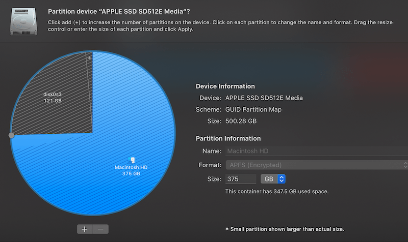

In this blog post, I'm going to share how to install NixOS 21.11 on an early-2013
MacBook Pro. 

The specs of the laptop are:

```
Model Identifier:	MacBookPro10,1
Processor Name:	Quad-Core Intel Core i7
Processor Speed:	2.7 GHz
Total Number of Cores:	4
Memory:	16 GB
Chipset Model:	Intel HD Graphics 4000
Chipset Model:	NVIDIA GeForce GT 650M
Wifi:	Broadcom BCM4331
```

The setup will dual-boot macOS and NixOS. This guide will show how to install
the base system (without GUI) with a working wifi connection.

# Creating a custom installation ISO

The NixOS installation CD doesn't ship with any proprietary software, and is
therefore missing the driver for the Broadcom BCM4331 wifi card. 

To solve this problem, I decided to build a custom installation CD 
that is based on the NixOS minimal installation CD but with the required
Broadcom drivers included.

## VirtualBox

Building the custom image can't be done on macOS, so we have to download the
[NixOS VirtualBox image](https://nixos.org/download.html#nixos-virtualbox)
appliance and import it into VirtualBox. 

The NixOS VirtualBox image already includes the Guest Additions, which allow USB
port forwarding (necessary to flash the resulting ISO on a USB drive) and
clipboard sharing between host and guest.

When importing the OVA file into VirtualBox, make sure to increase the amount of
CPU cores (the default is 1 core) to speed up the build process.

After starting the VM, we'll notice that the text in KDE is too small due to the
MacBook's Retina screen. We can fix this by going to Settings -> System
Settings -> Display and Monitor and setting the Global Scale to 200%.

To enable shared clipboard in VirtualBox, go to the menu bar and click on Devices
-> Shared Clipboard -> Bidirectional.

## Installation CD Nix configuration

Open the terminal (Konsole) and create a file called `iso.nix` with
the following content:

```
{ config, pkgs, ... }:

{
  imports = [
    <nixpkgs/nixos/modules/installer/cd-dvd/installation-cd-minimal.nix>
    <nixpkgs/nixos/modules/installer/cd-dvd/channel.nix>
  ];

  nixpkgs.config.allowUnfree = true;
  boot.kernelModules = [ "wl" ];
  boot.extraModulePackages = [ config.boot.kernelPackages.broadcom_sta ];
  boot.blacklistedKernelModules = [ "b43" "bcma" ];
}
```

Note that vim is not installed by default. Either use `nano` or run `nix-shell -p vim`.


I've blacklisted the open-source Broadcom drivers since they would
otherwise be loaded during boot and throw errors about unsupported
hardware.

To build the ISO image, run the following command:

```
sudo nix-build '<nixpkgs/nixos>' -A config.system.build.isoImage -I nixos-config=iso.nix
```

The password is `demo`.

After the build process is finished, the ISO can be found in the `result/iso/` directory:

```
result/iso/nixos-21.11.333823.96b4157790f-x86_64-linux.iso
```

# Flashing the ISO to a USB drive

Insert a FAT32 formatted USB drive and enable VirtualBox USB forwarding by
clicking in the VirtualBox menubar under Devices -> USB -> Generic Mass Storage.
A popup should show up in KDE with the option to mount the drive.

We need to find the interface name of our USB drive:

```
$ sudo fdisk -l

Disk /dev/sdb: 7.5 GiB, 8053063680 bytes, 15728640 sectors
Disk model: Flash Disk      
...
Device     Boot Start      End  Sectors  Size Id Type
/dev/sdb1        2048 15728639 15726592  7.5G  b W95 FAT32
```

Look for `Flash Disk`. In my case, the interface name is `/dev/sdb`.

Copy the ISO image to the USB drive:

```
$ sudo dd if=result/iso/nixos-21.11.333823.96b4157790f-x86_64-linux.iso of=/dev/sdb bs=4M

191+1 records in
191+1 records out
803209216 bytes (803 MB, 766 MiB) copied, 68.3789 s, 11.7 MB/s
```

After the process is finished, we can eject the USB drive and power off the VM:

```
eject /dev/sdb
poweroff
```

# Creating partitions

I used `Disk Utility` to shrink the macOS partition, and left one
quarter of the available disk space for the NixOS system:



I then used `gdisk` (install with `brew install gptfdisk`) to create a root partition and a
4 GB swap partition for NixOS.

This is the initial partition layout before running any commands:

```
$ sudo gdisk /dev/sda

Command (? for help): p
Disk /dev/disk0: 977105060 sectors, 465.9 GiB
...
Total free space is 244346569 sectors (116.5 GiB)

Number  Start (sector)    End (sector)  Size       Code  Name
   1              40          409639   200.0 MiB   EF00  EFI system partition
   2          409640       732758463   349.2 GiB   AF0A  Macintosh HD
```

To create the root partition:

```
Command (? for help): n
Partition number (3-128, default 3): 
First sector (34-977105026, default = 732758464) or {+-}size{KMGTP}: 
Last sector (732758464-977105026, default = 977105026) or {+-}size{KMGTP}: -4G
Current type is AF00 (Apple HFS/HFS+)
Hex code or GUID (L to show codes, Enter = AF00): 8300
Changed type of partition to 'Linux filesystem'
```

To create the swap partition:

```
Command (? for help): n
Partition number (4-128, default 4): 
First sector (34-977105026, default = 968716424) or {+-}size{KMGTP}: 
Last sector (968716424-977105026, default = 977105026) or {+-}size{KMGTP}: 
Current type is AF00 (Apple HFS/HFS+)
Hex code or GUID (L to show codes, Enter = AF00): 8200
Changed type of partition to 'Linux swap'

```

The resulting layout should look like this:

```
Command (? for help): p
Disk /dev/disk0: 977105060 sectors, 465.9 GiB
...
Total free space is 11 sectors (5.5 KiB)

Number  Start (sector)    End (sector)  Size       Code  Name
   1              40          409639   200.0 MiB   EF00  EFI system partition
   2          409640       732758463   349.2 GiB   AF0A  Macintosh HD
   3       732758464       968716418   112.5 GiB   8300  Linux filesystem
   4       968716424       977105026   4.0 GiB     8200  Linux swap
```

Remember the device name and the partition numbers, we'll need them later during
the NixOS installation when creating the file system. In my case, the root
file system is at `/dev/sda3` and swap is at `/dev/sda4`.

# Installing rEFInd

To dual-boot macOS and NixOS, I'm using rEFInd as the EFI bootloader.

It can be downloaded from the [rEFInd
website](https://www.rodsbooks.com/refind/getting.html) as a binary zip file.
After unpacking the file, we can install it by running the `refind-install`
command:

```
$ ./refind-install

Not running as root; attempting to elevate privileges via sudo....
Password:
ShimSource is none
Installing rEFInd on macOS....
Installing rEFInd to the partition mounted at /Volumes/ESP
Found rEFInd installation in /Volumes/ESP/EFI/refind; upgrading it.
Found suspected Linux partition(s); installing ext4fs driver.
Installing driver for ext4 (ext4_x64.efi)
Copied rEFInd binary files
```

# Boot into USB drive

To boot into the NixOS installation image, plug in the USB drive and restart the
computer, then select the USB drive in the boot menu.

You'll notice that the terminal font is very small (due to the retina screen).
We can make it larger with:

```
setfont ter-v32n
```

# Formatting and mounting partitions

Next we need to format our partitions and mount them. I chose ext4 as a
file system and used LUKS to encrypt the disk: 

```
# format with luks and open the encrypted partition
cryptsetup luksFormat /dev/sda3
cryptsetup open /dev/sda3 nixosroot

# create filesystem
mkfs.ext4 /dev/mapper/nixosroot

# mount partition
mount /dev/mapper/nixosroot /mnt
mkdir /mnt/boot
mount /dev/sda1 /mnt/boot
```

Set up the swap area and turn on swapping:

```
mkswap -L nixosswap /dev/sda4
swapon /dev/disk/by-label/nixosswap
```

# Enable Wifi Networking

We enable wifi networking since NixOS needs internet access for the installation.

In our custom installation image, the proprietary Broadcom `wl` kernel module
will automatically load during boot. In the terminal we need to connect to a wifi
network using `wpa_supplicant`:

```
# get the wifi interface name. for me it is `wlp4s0`
ip link

# connect to wifi network. replace `myssid` and `mypassword`
wpa_supplicant -B -i wlp4s0 -c <(wpa_passphrase "myssid" "mypassword")
```

This will start `wpa_supplicant` as a background process. After we've installed
the system we will set it up as a daemon.

# NixOS installation

We generate a NixOS configuration file template:

```
nixos-gen --config --root /mnt
```

Then edit `/mnt/etc/nixos/configuration.nix` and add the following settings:

```
boot.loader.grub.enable = false;
boot.loader.systemd-boot.enable = true;
boot.loader.efi.canTouchEfiVariables = true;

# the default governor constantly runs all cores on max frequency
# schedutil will run at a lower frequency and boost when needed
powerManagement.cpuFreqGovernor = "schedutil";

# install wpa_supplicant
networking.wireless.enable = true;

# allow unfree packages (broadcom wifi drivers)
nixpkgs.config.allowUnfree = true;
```

Start the installation:

```
nixos-install
```

After the installation is done, we can reboot the system and select the new NixOS
installation from the boot menu.

# Wifi setup

After we've booted into our new system. we need to setup the wifi connection
(again).

We can use the same command as before (minus the `-B` flag) and write it to the
`wpa_supplicant.conf` file which will automatically get loaded when
`wpa_supplicant` starts during boot:

```
wpa_supplicant -i wlp4s0 -c <(wpa_passphrase "myssid" "mypassword") >
/etc/wpa_supplicant.conf

systemctl restart wpa_supplicant.service
```

# Conclusion

Installing NixOS on the MacBook Pro was a great learning experience and
fairly easy to do.

Most things work fine out of the box. However, I've experienced significantly
lower battery life and louder fans due to higher (~15C) CPU idle temperatures
and not being able to switch GPUs on-demand (Nvidia GPU is always active).
These problems are not specific to NixOS, I've experienced the same issues in other major distributions on this laptop.

# Links

The following sites were very helpful when trying to install NixOS:

- [ArchWiki page on MacBookPro10,x](https://wiki.archlinux.org/title/MacBookPro10,x)
- [Install Linux on a MacBook Air](https://thoughtbot.com/blog/install-linux-on-a-macbook-air)
- [Linux On A Macbook Pro 10,1](https://unencumberedbyfacts.com/2013/08/16/linux-on-a-macbook-pro-101/)
