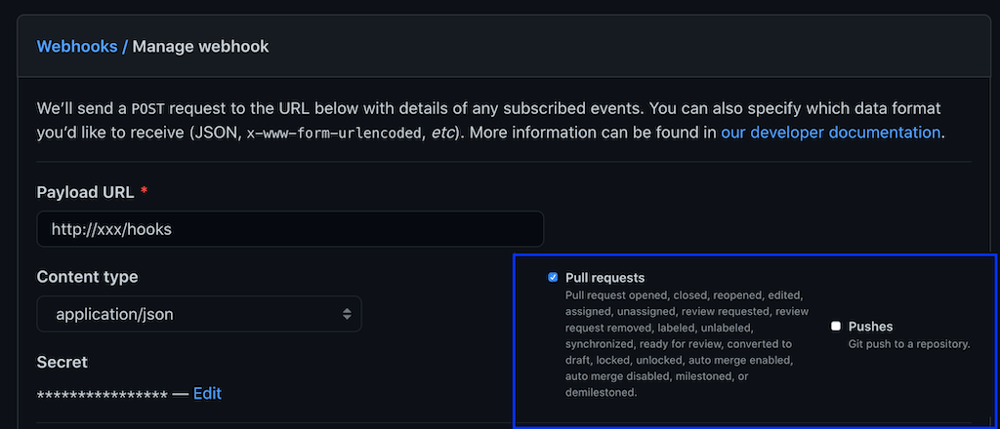

In a [previous blog
post](https://www.arthurkoziel.com/creating-ci-pipelines-with-tekton-part-1/)
we've used [Tekton Pipelines](https://github.com/tektoncd/pipeline) to set up a
simple pipeline that runs tests, builds a docker image and pushes it to a
registry.

In this blog post we're going to take a look at [Tekton
Triggers](https://github.com/tektoncd/triggers) and integrate it with GitHub.
We're going to setup a GitHub webhook that will automatically run our pipeline
when a GitHub PR is opened or new commits are pushed to an existing PR branch.

All code examples in this blog post are available in a [GitHub repo](https://github.com/arthurk/tekton-triggers-example).

## Table of contents

- [Requirements](#requirements)
- [Installation](#installation)
- [Creating a Pipeline](#creating-a-pipeline)
- [Creating Resources for Tekton Triggers](#creating-resources-for-tekton-triggers)
  - [EventListener](#eventlistener)
  - [GitHub Interceptor](#github-interceptor)
  - [CEL Interceptor](#cel-interceptor)
  - [TriggerBinding](#triggerbinding)
  - [TriggerTemplate](#triggertemplate)
  - [Ingress](#ingress)
- [Adding the webhook to Github](#adding-the-webhook-to-github)
- [Creating a PR and testing our trigger](#creating-a-pr-and-testing-our-trigger)
- [Summary](#summary)

## Requirements

For this tutorial we need a Kubernetes cluster with an
ingress-controller installed that can give us an external IP.

We also need a GitHub repository where we can add the webhook.

## Installation

Tekton Triggers requires Tekton Pipelines to be installed. We also need to install the core interceptors (GitHub, GitLab, BitBucket, and CEL) manifests as we'll use them later on.

By default all resources will be installed in the `tekton-pipelines` namespace.

```
# Tekton Pipelines
kubectl apply -f https://storage.googleapis.com/tekton-releases/pipeline/previous/v0.23.0/release.yaml

# Tekton Triggers + Interceptors
kubectl apply -f https://storage.googleapis.com/tekton-releases/triggers/previous/v0.13.0/release.yaml
kubectl apply -f https://storage.googleapis.com/tekton-releases/triggers/previous/v0.13.0/interceptors.yaml
```

Configure RBAC for our Tekton Triggers service account:

```
kubectl apply -f https://raw.githubusercontent.com/arthurk/tekton-triggers-example/master/01-rbac.yaml
```

## Creating a Pipeline

We're going to use a simple pipeline that clones a Git repo with a Go application in it and runs the tests. The example application can be found at [GitHub](https://github.com/arthurk/go-example-app).

**[pipeline.yaml](https://github.com/arthurk/tekton-triggers-example/blob/master/02-pipeline.yaml)**:
```
apiVersion: tekton.dev/v1beta1
kind: Pipeline
metadata:
  name: github-pr-pipeline
spec:
  resources:
    - name: source
      type: git
  tasks:
    - name: test
      taskRef:
        name: test
      resources:
        inputs:
          - name: source
            resource: source
---
apiVersion: tekton.dev/v1beta1
kind: Task
metadata:
  name: test
spec:
  resources:
    inputs:
      - name: source
        type: git
  steps:
    - name: run-test
      image: golang:1.16.3-alpine3.13
      workingDir: /workspace/source
      command: ["go"]
      args: ["test"]
```

## Creating Resources for Tekton Triggers

For our project we need to create the following resources:

- `EventListener`: A Kubernetes Service that listens for incoming HTTP requests and executes a Trigger. 
- `Trigger`: Decides what to do with the received event. Sets a TriggerBinding, TriggerTemplate and Interceptor to run.
- `TriggerBinding`: Specifies the data to be extracted from the request and saved as parameters. This data will be passed to the TriggerTemplate.
- `TriggerTemplate`: A template of a resource (TaskRun/PipelineRun) to be created when an event is received.
- `Interceptor`: Processes an event to do custom validation or filtering

### EventListener

An `EventListener` processes an incoming request and executes a `Trigger`. Our
EventListener looks like this:

**[eventlistener.yaml](https://github.com/arthurk/tekton-triggers-example/blob/master/03-eventlistener.yaml)**:
```
apiVersion: triggers.tekton.dev/v1alpha1
kind: EventListener
metadata:
  name: github-pr
spec:
  serviceAccountName: tekton-triggers-example-sa
  triggers:
    - name: github-listener
      interceptors:
        - ref:
            name: "github"
          params:
            - name: "secretRef"
              value:
                secretName: github-interceptor-secret
                secretKey: secretToken
            - name: "eventTypes"
              value: ["pull_request"]
        - ref:
            name: "cel"
          params:
            - name: "filter"
              value: "body.action in ['opened', 'synchronize', 'reopened']"
      bindings:
        - ref: github-pr-binding
      template:
        ref: github-pr-pipeline-template
```

After receiving the incoming request it will execute the `github-listener`
Trigger. In this case the Trigger is embedded into the EventListener resource
rather than specified in a separate resource. 

Our github-listener trigger will then make use of `Interceptor`'s. An
Interceptor let's us validate or modify incoming requests before they trigger a
pipeline run. We embed the Interceptor resource rather than putting it into a
separate resource manifest.

### GitHub Interceptor

The first interceptor we're running is called `github`. It's part of the core
interceptors that we installed above. It makes sure that the request:

- has a valid format for GitHub webhooks
- matches a pre-defined secret (that we'll set later) 
- matches the `pull_request` event type

The github interceptor requires a secret token. This token is set when creating
the webhook in GitHub and will be validated by the github interceptor when the
request arrives:

**[secret.yaml](https://github.com/arthurk/tekton-triggers-example/blob/master/04-secret.yaml):**
```
apiVersion: v1
kind: Secret
metadata:
  name: github-interceptor-secret
type: Opaque
stringData:
  secretToken: "1234567"
```

### CEL Interceptor

The second interceptor we're using is called `cel` and is also included in the
core interceptor manifests that we installed above. Interceptors are executed in
the order they're specified. The cel interceptor will run after the github
interceptor.

It let's us specify a [CEL](https://github.com/google/cel-go) filter expression
that will be applied to requests.

We'll apply this filter expression because GitHub `pull_request` events are sent
for every action performed on a pull request (`assigned`, `unassigned`,
`converted_to_draft`, ...).

For this tutorial we only need to know when a PR was `opened`, `reopened` or
`synchronized` (commits pushed to the PR branch). The CEL filter checks the
webhook request `body.action` and filters our any events that don't match those
actions.

### TriggerBinding

After the event listener is done validating and modifying the incoming request,
we need to extract values from it and bind them to variables that we can later
use in our Pipeline. This is what a `TriggerBinding` is used for.

Our TriggerBinding looks like this:

**[triggerbinding.yaml](https://github.com/arthurk/tekton-triggers-example/blob/master/05-triggerbinding.yaml)**:
```
apiVersion: triggers.tekton.dev/v1alpha1
kind: TriggerBinding
metadata:
  name: github-pr-binding
spec:
  params:
    - name: gitrepositoryurl
      value: $(body.repository.clone_url)
    - name: gitrevision
      value: $(body.pull_request.head.sha)
```

We're only interested in the followinw two fields which are necessary to clone
the repo at a specific revision:

- gitrepositoryurl: the url of the repo to clone (https://...)
- gitrevision: the commit SHA to check out

The parameters are passed to a `TriggerTemplate`.

### TriggerTemplate

A TriggerTemplate is responsible for dynamically generating a resource. In our
case it's a `PipelineRun`.

The TriggerTemplate receives the two variables from the previously created
TriggerBinding and makes them available under `spec.resourcetemplates`.

**[triggertemplate.yaml](https://github.com/arthurk/tekton-triggers-example/blob/master/06-triggertemplate.yaml)**:
```
apiVersion: triggers.tekton.dev/v1alpha1
kind: TriggerTemplate
metadata:
  name: github-pr-pipeline-template
spec:
  params:
    - name: gitrevision
      description: The git revision (SHA)
      default: master
    - name: gitrepositoryurl
      description: The git repository url ("https://github.com/foo/bar.git")
  resourcetemplates:
    - apiVersion: tekton.dev/v1beta1
      kind: PipelineRun
      metadata:
        generateName: github-pr-pipeline-run-
      spec:
        pipelineRef:
          name: github-pr-pipeline
        resources:
          - name: source
            resourceSpec:
              type: git
              params:
                - name: revision
                  value: $(tt.params.gitrevision)
                - name: url
                  value: $(tt.params.gitrepositoryurl)
```

Note that to access variables from a triggertemplate inside a resourcetemplate
they need to be prefixed with `$tt`.

### Ingress

For GitHub to be able to send a request to our event listener we need to expose
it by creating an Ingress resource and pointing it to our event listener
service:

**[ingress.yaml](https://github.com/arthurk/tekton-triggers-example/blob/master/07-ingress.yaml)**:
```
apiVersion: networking.k8s.io/v1
kind: Ingress
metadata:
  name: ingress-resource
  annotations:
    kubernetes.io/ingress.class: nginx
    nginx.ingress.kubernetes.io/ssl-redirect: "false"
spec:
  rules:
    - http:
        paths:
          - path: /hooks
            pathType: Exact
            backend:
              service:
                name: el-github-pr
                port:
                  number: 8080
```

An EventListener will create a service with the `el-` prefix followed by the
name of the event-listener. Our event-listener is named `github-pr`, so the
EventListener Service is named `el-github-pr`. EventListener services will always use port 8080.

Make sure to note the external IP address of your ingress. In this example it's `123.123.1.1`:

```
kubectl get ingress
NAME               CLASS    HOSTS   ADDRESS        PORTS   AGE
ingress-resource   <none>   *       123.123.1.1    80      26d
```

We can now send GitHub webhook requests to `http://123.123.1.1/hooks` and automatically trigger a PipelineRun.

## Adding the webhook to Github

In your GitHub repo go to `Settings -> Webhooks` and click `Add Webhook`. The
fields we need to set are:

- Payload URL: Your external IP Address from the Ingress with `/hooks` path
- Content type: `application/json`
- Secret: `1234567`

Under events select `Let me select individual events`. Uncheck `Pushes` and check `Pull requests`.



After saving the webhook, GitHub will send a ping event. It will be filtered out by our Interceptor which only allows `pull_request` events, but we can check the EventListener Pod logs to verify it:

```
kubectl get pods | grep el-github-pr
el-github-pr-7df7f66d57-kqd6k     1/1     Running   0          13s

kubectl logs el-github-pr-7df7f66d57-kqd6k
...
{
  "level": "info",
  "ts": "2021-05-01T08:48:59.461Z",
  "logger": "eventlistener",
  "caller": "sink/sink.go:240",
  "msg": "interceptor stopped trigger processing: rpc error: code = FailedPrecondition desc = event type ping is not allowed",
  "knative.dev/controller": "eventlistener",
  "/triggers-eventid": "f43a88c2-a462-47c9-a6cd-f98de681da40",
  "/trigger": "github-listener"
}
```

## Creating a PR and testing our trigger

Let's test that everything works by creating a PR, either manually or using the [GitHub CLI](https://github.com/cli/cli/):

```
git switch -c webhook-test
git commit --allow-empty -m "trigger webhook"
gh pr create -f
```

And checking for a PipelineRun to get created:

```
kubectl get pr
NAME                           SUCCEEDED   REASON      STARTTIME   COMPLETIONTIME
github-pr-pipeline-run-qfvsx   True        Succeeded   73s         44s
```

We can see that everything worked. The pipeline was triggered and the run
succeeded.

## Summary

In this tutorial we used Tekton Pipelines and Tekton Triggers to automatically
trigger a pipeline run when a GitHub PR is created or commits have been pushed
to its branch.

We setup a GitHub webhook that will send a Pull Request event to our Kubernetes
Ingress controller where it is passed on to the EventListener Service. The
service will use Interceptors to validate and filter the webhook payload. The
validated payload is passed to the TriggerBinding which will extract data from
the webhook request and map it to parameters. Lastly the TriggerTemplate will
populate a PipelineRun manifest with those parameters and create the resource,
which will then be picked up by Tekton Pipelines and processed.

To improve our pipeline futher we could send the status of the pipeline
(pending, running, failed) back to github, which will then display it in the web
UI. There's a Task for that in the [Tekton
Catalog](https://github.com/tektoncd/catalog/tree/main/task/github-set-status/0.2)
which is easy to integrate. Or maybe we could [add a
comment](https://github.com/tektoncd/catalog/tree/main/task/github-add-comment)
to the PR with more detailed information.

Tekton Triggers is still in alpha phase and things change very frequently. You
can keep up with the development of the project by checking the the
[Triggers](https://github.com/tektoncd/triggers/) repo for code changes and the
[Community](https://github.com/tektoncd/community) repo for feature proposals
and discussion around them. 

If you spot any mistakes in this blog post please let me know via email.


