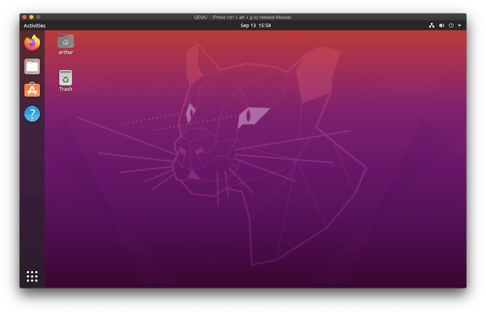

In this blog post we're going to create a Ubuntu 20.04 VM using [QEMU](https://www.qemu.org/) on MacOS.



QEMU is a hardware emulator which can make use of different accelerators when running VMs. The most popular accelerator is [KVM](https://www.linux-kvm.org/page/Main_Page) which is built into the Linux kernel and allows Linux hosts to run VMs with native performance.

Using QEMU on macOS used to be very slow as no accelerator was available. This changed 2 years ago when the project [added support](https://wiki.qemu.org/ChangeLog/2.12) for the macOS native hypervisor with Hypervisor.framework (HVF) as an accelerator.

Before we begin with the setup I assume that the [Ubuntu 20.04 Desktop ISO](https://releases.ubuntu.com/20.04/) has been downloaded in the current working directory.

## QEMU Installation

We can use Homebrew to install QEMU. The version we're using in this tutorial is 5.1.0:

```shell
$ brew install qemu

qemu-system-x86_64 --version
QEMU emulator version 5.1.0
Copyright (c) 2003-2020 Fabrice Bellard and the QEMU Project developers
```

It will pull in a few dependencies (the package depends on 14 other packages) and the installation can take a few minutes.

## Create the disk image

Once the installation is done, we can create the disk image that we're going to install Ubuntu on.

We're using the QCOW2 format to create a 20GB image. This can be resized later on if needed. The Ubuntu installation took around 5GB of space when I installed it. 

```shell
qemu-img create -f qcow2 ubuntu-20.04.1-desktop-amd64.qcow2 20G
```

## Boot machine with Ubuntu ISO mounted


We can now boot up the machine with the Ubuntu ISO attached as a

In this step we boot up the machine with the Ubuntu ISO mounted in the CD drive:

```shell
qemu-system-x86_64 \
	-machine type=q35,accel=hvf \
	-cpu host \
	-smp 2 \
	-hda ubuntu-20.04.1-desktop-amd64.qcow2 \
	-cdrom ./ubuntu-20.04.1-desktop-amd64.iso \
	-m 4G \
	-vga virtio \
	-usb \
	-device usb-tablet \
	-display default,show-cursor=on
```

The options are:

- `-machine`: The emulated machine and the accelerator. q35 is the newest machine type and HVF is the macOS native hypervisor.
- `-cpu`: The CPU architecture. The value `host` will use the HVF processor with all supported host features
- `-smp`: Number of CPUs to use
- `-m`: Amount of memory to use
- `-hda`: Disk drive (the one we created earlier)
- `-cdrom`: The ISO image to put into the CD drive
- `-vga`: The graphic card to use. I found `virtio` (based on [Virgil](https://virgil3d.github.io/) to have the best performance
- `-usb`: Enable USB host controller
- `-device` Adding a "usb-tablet" as an input device. I'm running this on a laptop and without this setting the mouse did not work.
- `-display`: To show the mouse cursor (disabled by default)

During testing I had problems with the Linux kernel as it would panic during the boot process. The issue was the `-cpu host` parameter. I fixed it by specifying the CPU architecture manually (see `qemu-system-x86_64 -cpu help` for a list of all available architectures).

My machine has an IvyBridge processor (Core i7):

```shell
$ sysctl -n machdep.cpu.brand_string

Intel(R) Core(TM) i7-3740QM CPU @ 2.70GHz
```

And using `-cpu IvyBridge` would fail. However when using `-cpu Nehalem` ([also an i7 CPU](https://en.wikipedia.org/wiki/List_of_Intel_CPU_microarchitectures)) everything worked well.

Now after the machine is booted up the Ubuntu installer will run. Follow the installation steps and don't restart the VM at the end of the installation, instead shut it down by stopping the qemu process with CTRL-C on the host.

## Boot without ISO mounted

When running the VM we don't need the Ubuntu ISO mounted and can remove it by leaving out the `-cdrom` option:

```shell
qemu-system-x86_64 \
	-machine type=q35,accel=hvf \
	-cpu host \
	-smp 2 \
	-hda ubuntu-20.04.1-desktop-amd64.qcow2 \
	-m 4G \
	-vga virtio \
	-usb \
	-device usb-tablet \
	-display default,show-cursor=on
```

## Conclusion

In my experience QEMU is faster, more responsive and uses less CPU/RAM than VirtualBox. I didn't have to configure any display scaling for HiDPI screens as it worked out of the box. The only thing I'm missing are shared clipboards and drag-and-drop of files (which are available when installing the VirtualBox Guest Additions).
