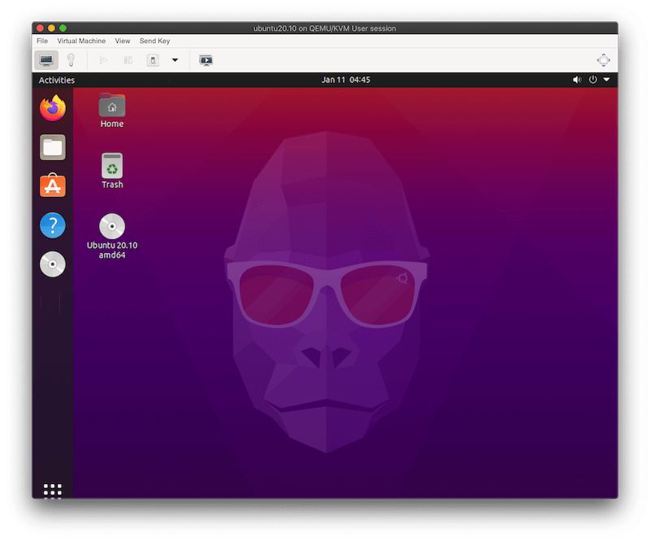
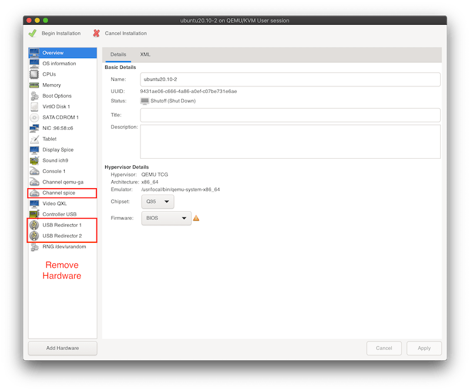
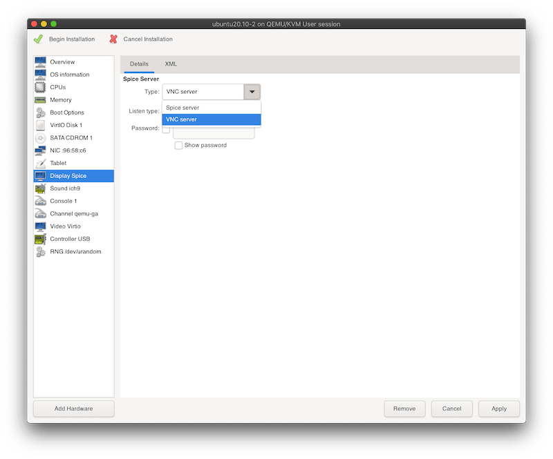
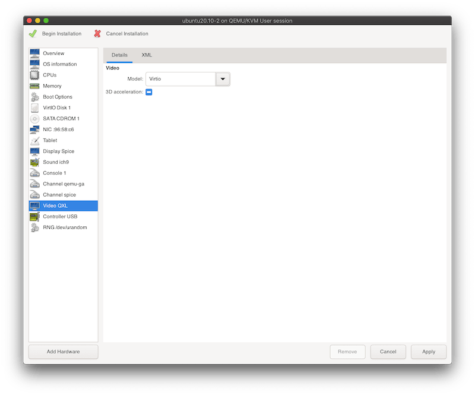

I've previously written about [using QEMU on macOS to create an Ubuntu VM](https://www.arthurkoziel.com/qemu-ubuntu-20-04/) via
CLI. In this blog post I'm going to describe how to install [libvirt](https://libvirt.org/) and
[virt-manager](https://virt-manager.org/) on macOS to create an [Ubuntu](https://ubuntu.com/) VM via [QEMU](https://www.qemu.org/) from the virt-manager GUI.

What's described in this blog post was more of an experiment to see if it would
work. Running libvirt locally is very slow and not usable due to the missing
support for the HVF
[Hypervisor.Framework](https://developer.apple.com/documentation/hypervisor). 

If you're only interested in running virt-manager on macOS (and connect to remote machines) you can skip the steps after the virt-manager installation.



## Description

Libvirt uses a hypervisor (such as QEMU) to run a VM and provides an API to
manage it. API Clients are available for many languages such as Python, Go or
Rust.

Virt-manager is a Python application that provides a GUI to manage VMs though
the libvirt API.

## Installation

Libvirt is available in Homebrew and the installation
can be done with a single command:

```
brew install libvirt
```

Virt-manager is not available in Homebrew but there's a [custom
formula](https://github.com/jeffreywildman/homebrew-virt-manager) available that makes it
convenient to install it. However, this formula is outdated and
fails to run on macOS Catalina and Big Sur.

To fix this I've [created a fork](https://github.com/arthurk/homebrew-virt-manager) with
updated dependencies. It can be installed via a custom tap:

```
brew tap arthurk/homebrew-virt-manager
brew install virt-manager virt-viewer
```

The installation might take a few minutes due to many dependencies.

## Usage

When the installation has finished we can test it by starting the libvirtd daemon:

```
brew services start libvirt
```

and then virt-manager with a connection to it:

```
virt-manager -c "qemu:///session" --no-fork
```

The original Homebrew formula had a custom patch applied that made `--no-fork`
the default behaviour (launching it in the foreground). To make it easier to
maintain the formula I've removed the patch. If the process should run in the
foreground the `--no-fork` argument needs to be specified or else it will run in
the background.

Note that the virt-manager window will be hidden after starting. It will show up
in the Dock (the icon is a rocket) and clicking on it will bring it into the
foreground.

## Creating a VM

As an example I'm creating a Ubuntu 20.10 VM.

Virt-manager assumes that [SPICE](https://www.spice-space.org/) is available and will add it to the default
settings. However, it's is not supported on macOS and therefore we need to change a
the default values to remove all SPICE related settings:

Make sure to check the customize box before starting the VM:


In the customization window we need to remove all hardware related to SPICE (Right-Click -> Remove Hardware):

- Channel spice
- USB Redirector 1
- USB Redirector 2



In the **Display** section set the type to VNC server:



In the **Video** section set the model to Virtio:



Apply these changes and click on *Begin Installation* in the top left corner. It
will open a window that boots into the Ubuntu installer. From there on we can
follow the installer. The default settings are usually fine.

## Conclusion

As mentioned above this was an experiment. The VM runs very slow due to the missing support for HVF (Hypervisor.Framework). The
focus of libvirt is on KVM/Linux hosts. I wouldn't use it on a daily
basis on macOS and instead stick to the QEMU CLI with HVF set as the accelerator. You can
check my [previous blog post](https://www.arthurkoziel.com/qemu-ubuntu-20-04/) on how to do that.
