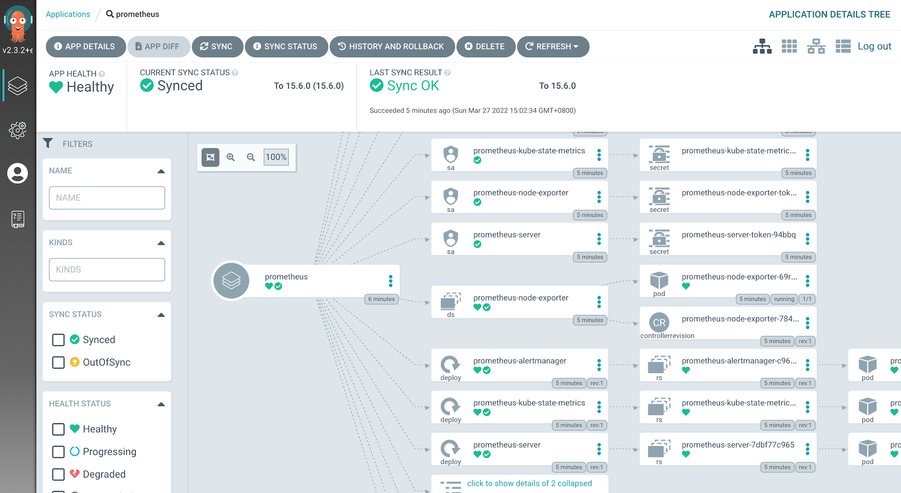
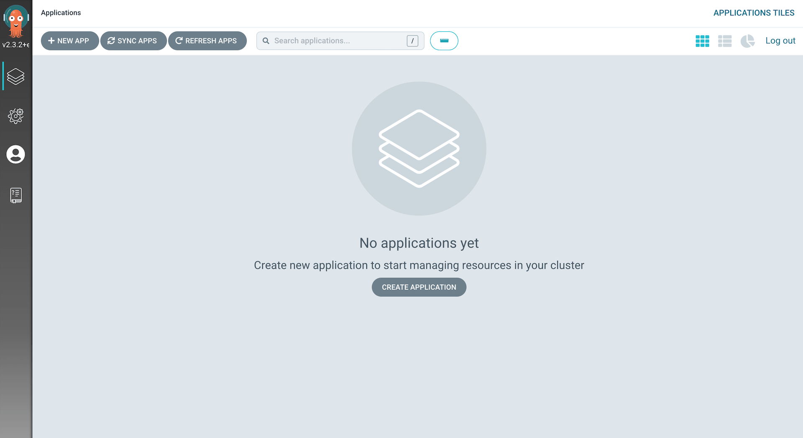
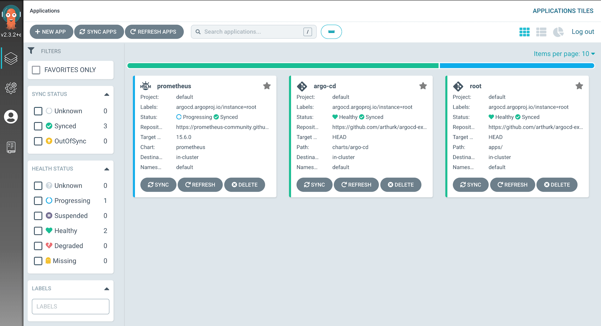

In this blog post we're going to setup [Argo CD](https://argoproj.github.io/argo-cd/) on a Kubernetes cluster. We'll install it through Helm, create a root application to use the [app-of-apps](https://argoproj.github.io/argo-cd/operator-manual/declarative-setup/#app-of-apps) pattern and set it up so that Argo CD can update itself.



All files mentioned in this blog post are available in a [Git repository on GitHub](https://github.com/arthurk/argocd-example-install/).

## What is Argo CD?

[Argo CD](https://argoproj.github.io/argo-cd/) is a [GitOps](https://www.gitops.tech/) tool to automatically syncronize the cluster to the desired state defined in a Git repository. Each workload is defined declaratively through a resource manifest in a YAML file and stored inside a Git repository. Argo CD checks if the state defined in the Git repository matches what is running on the cluster and synchronizes it if changes were made.

For example, instead of running CLI commands to update resources resource with `kubectl apply` or `helm upgrade`, we would update an `Application` manifest inside our Git repository and push the changes. Argo CD will recognize that the manifests have changed and automatically synchronize the resources on the cluster.

With this workflow the security is improved. A connection to the cluster, either from the developers laptop or from a CI/CD system, is no longer needed as changes are pulled from the Git repository by an Kubernetes Operator running inside the cluster.

## Requirements

For this tutorial we'll need:

- A Kubernetes cluster and kubectl (1.19.1)
- Helm (3.4.2)
- A public git repository

The version numbers behind the tools are the ones I've used to write this tutorial.

## Creating a Helm chart

We'll use Helm to install Argo CD with the chart from [argoproj/argo-helm](https://github.com/argoproj/argo-helm/tree/master/charts/argo-cd). As our setup needs to override default values, we'll create our own Helm "umbrella" chart that pulls in the original Argo CD chart as a dependency.

Using this approach also lets us bundle extra resources with the chart in the future. For example, we can install credentials that are used to authenticate with private Git or Helm repositories by placing them in the chart's `template` directory.

In our Git repository we create a directory for the chart and place two files in it:

```
mkdir -p charts/argo-cd
```

Chart.yaml

```
apiVersion: v2
name: argo-cd
version: 1.0.0
dependencies:
  - name: argo-cd
    version: 2.11.0
    repository: https://argoproj.github.io/argo-helm
```

values.yaml

```
argo-cd:
  installCRDs: false
  global:
    image:
      tag: v1.8.1
  dex:
    enabled: false
  server:
    extraArgs:
      - --insecure
    config:
      repositories: |
        - type: helm
          name: stable
          url: https://charts.helm.sh/stable
        - type: helm
          name: argo-cd
          url: https://argoproj.github.io/argo-helm
```

We set the following values for our installation:

- `installCRDs` is set to `false`. This is required when using Helm 3 to avoid warnings about nonexistant webhooks
- The Helm chart defaults to Argo CD version `1.7.6`. To use the latest version we bump `global.image.tag` to `1.8.1`
- We disable the `dex` component that is used for integration with external auth providers
- We start the server with the `--insecure` flag to serve the Web UI over http (I'm using a local k8s server without TLS setup)

Before we install the chart we need to generate a `Chart.lock` file. We do this so that our dependency (the original `argo-cd` chart) can be rebuilt to an exact version (this is important later on when we let Argo CD manage this chart):

```
helm repo add argo-cd https://argoproj.github.io/argo-helm
helm dep update charts/argo-cd/
```

This will generate two files: 

- Chart.lock
- charts/argo-cd-2.11.0.tgz

The `tgz` file is the downloaded dependency and not required in our Git repository as Argo CD can download the dependencies by itself. We exclude it by creating a `.gitignore` file in the chart directory:

```
echo "charts/" > charts/argo-cd/.gitignore
```

The chart is ready. We can add and push it to our Git repository:

```
git add charts/argo-cd
git commit -m 'add argo-cd chart'
git push
```

## Installing the Argo CD Helm chart

We install the previously created Helm chart:

```
helm install argo-cd charts/argo-cd/
```

Later on we'll let Argo CD manage itself so that we can perform updates by modifying files inside the Git repository rather than running manual commands.

**Note**: There will be warnings about deprecated CRDs:

```
apiextensions.k8s.io/v1beta1 CustomResourceDefinition is deprecated in v1.16+, unavailable in v1.22+; use apiextensions.k8s.io/v1 CustomResourceDefinition
```

These warnings can safely be ignored for now. There's a [PR](https://github.com/argoproj/argo-helm/pull/514) to fix this issue in future chart versions.

## Accessing the Web UI

The Helm chart doesn't install an Ingress by default. To access the UI we have to port-forward to the service:

```
kubectl port-forward svc/argo-cd-argocd-server 8080:443
```

The Web UI is then available at [http://localhost:8080](http://localhost:8080). 

The default username is "admin". The password is auto-generated and defaults to the pod name of the Argo CD server pod. We can get it with:

```
kubectl get pods -l app.kubernetes.io/name=argocd-server -o name | cut -d'/' -f 2
```

After logging in for the first time we see that there are no applications yet:



To add applications to Argo CD, we need to write `Application` manifests.

## The root app

To add an application to Argo CD we need to add an `Application` resource to Kubernetes (a CRD that has been installed by Argo CD). Among other options, it defines the repository and the path under which to find the manifests (or, in our case, the Helm chart).

For example, if we wanted to deploy [Prometheus](https://prometheus.io/), we would write an `Application` manifest for it which would specify what Helm chart to use and what values to override. We would then apply it with kubectl and wait for the resource to be created. This process is repeated for any other applications we would want to add.

But applying the manifests with kubectl is a manual step that's error prone and needs to be done for each application. Since we want to automate our setup as much as possible, we can create a special application that implements the [app of apps pattern](https://argoproj.github.io/argo-cd/operator-manual/declarative-setup/#app-of-apps). We can call this the "root" application.

The root application has one task: it produces `Application` manifests for other applications. Argo CD will watch the root application and syncronize any applications that it produces.

With this setup we only have to add the root application manually. Any additional applications can be added in the Git repository.

## Creating the root app chart

To create our root app we'll create a Helm chart that has `Application` manifests as templates. We create it in the `apps` directory and put a `Chart.yaml` and empty `values.yaml` file in it:

```
mkdir -p apps/templates
touch apps/values.yaml
```

**Chart.yaml**:

```
apiVersion: v2
name: root
version: 1.0.0
```

We create the `Application` manifest in `apps/templates/root.yaml`:

```
apiVersion: argoproj.io/v1alpha1
kind: Application
metadata:
  name: root
  finalizers:
  - resources-finalizer.argocd.argoproj.io
spec:
  destination:
    server: https://kubernetes.default.svc
    namespace: default
  project: default
  source:
    path: apps/
    repoURL: https://github.com/arthurk/argocd-example-install.git
    targetRevision: HEAD
  syncPolicy:
    automated:
      prune: true
      selfHeal: true
```

The above `Application` watches the Helm chart under `apps/` (our root application) and synchronizes it if changes were detected.

How does Argo CD know our application is a Helm chart? It looks for a `Chart.yaml` file under `path` in the Git repository. If present, it will check the `apiVersion` inside it. For `apiVersion: v1` it uses Helm 2, for `apiVersion: v2` it uses Helm 3 to render the chart.

**Note**: Argo CD will not use `helm install` to install charts. It will render the chart with `helm template` and then apply the output with `kubectl`.

To deploy our root application we need to push the files to our Git repository and apply the manifest:

```
git add apps
git ci -m 'add root app'
git push

helm template apps/ | kubectl apply -f -
```

In the Web UI we can now see that the root application was created:


## Letting Argo CD manage itself

We previously installed Argo CD with `helm install` which means that updates would require us to use `helm upgrade`. To avoid doing this we can create an Application resource for Argo CD and let it manage itself.

With this approach any updates to our Argo CD deployment can be made by modifying files in our Git repository rather than running `helm` commands.

We put the application manifest in `apps/templates/argo-cd.yaml`:

```
apiVersion: argoproj.io/v1alpha1
kind: Application
metadata:
  name: argo-cd
  namespace: default
  finalizers:
  - resources-finalizer.argocd.argoproj.io
spec:
  destination:
    server: https://kubernetes.default.svc
    namespace: default
  project: default
  source:
    path: charts/argo-cd
    repoURL: https://github.com/arthurk/argocd-example-install.git
    targetRevision: HEAD
  syncPolicy:
    automated:
      prune: true
      selfHeal: true
```

Then we push the file to our Git repository:

```
git add apps/templates/argo-cd.yaml
git ci -m 'add argo-cd application'
git push
```

In the Web UI we should now see the root application as being `OutOfSync` and syncing. 

If it doesn't show the application immediately, click the "Refresh" button on the root application. By default the refresh interval to detect changes in the Git repository is 3 minutes.


Now that Argo CD manages itself we can delete it from Helm:

```
kubectl delete secret -l owner=helm,name=argo-cd
```

## Example: Installing Prometheus

To demonstrate how to deploy a Helm chart with Argo CD, we'll add [Prometheus](https://prometheus.io/) on our cluster. 

We add the application manifest in `apps/templates/prometheus.yaml`:

```
apiVersion: argoproj.io/v1alpha1
kind: Application
metadata:
  name: prometheus
  namespace: default
  finalizers:
  - resources-finalizer.argocd.argoproj.io
spec:
  destination:
    server: https://kubernetes.default.svc
    namespace: default
  project: default
  source:
    chart: prometheus
    helm:
      values: |
        pushgateway:
          enabled: false
    repoURL: https://prometheus-community.github.io/helm-charts
    targetRevision: 13.0.2
  syncPolicy:
    automated:
      prune: true
      selfHeal: true
```

Compared to our Argo CD chart from above the differences are:

- We're using `chart` instead of `path` to install a Helm chart from a Helm repository
- The `targetRevision` is the chart version
- The `repoURL` is set to the [prometheus-community](https://github.com/prometheus-community/helm-charts/) Helm chart repository
- We're overriding the chart's default values to disable the pushgateway

To deploy the application we push the manifest to our Git repository:

```
git add apps/templates/prometheus.yaml
git ci -m 'add prometheus'
git push
```

Prometheus should show up in the Web UI after the next refresh (click "Refresh" on the root application). 



To uninstall Prometheus we only have to delete the previously added `prometheus.yaml` file:

```
git rm apps/templates/prometheus.yaml
git ci -m 'remove prometheus'
git push
```

The application will be removed from the cluster after the next refresh.

## Conclusion

In this tutorial we've installed Argo CD from a Helm chart and set it up so that it can manage itself. Updates to Argo CD can be done by modifying the manifest inside the Git repository and waiting for Argo CD to update itself.

We've created a "root" application that uses the [app-of-apps](https://argoproj.github.io/argo-cd/operator-manual/declarative-setup/#app-of-apps) pattern to manage our applications in a declarative way.

To show how we can install applications with Argo CD, we've added (and then removed) Prometheus from our cluster.

More details about Argo CD can be found on the [project page](https://argoproj.github.io/argo-cd/) and the [GitHub repository](https://github.com/argoproj/argo-cd/).
