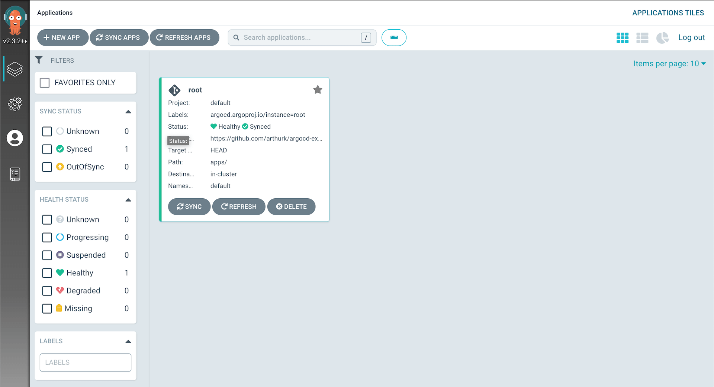

In this blog post we're going to setup [Argo CD](https://argoproj.github.io/argo-cd/) on a Kubernetes cluster. We'll install it with Helm, create an application to use the [app-of-apps](https://argoproj.github.io/argo-cd/operator-manual/declarative-setup/#app-of-apps) pattern and set everything up so that Argo CD can update itself.


All files mentioned in this blog post are available in a [Git repository on GitHub](https://github.com/arthurk/argocd-example-install/).

## What is Argo CD?

[Argo CD](https://argoproj.github.io/argo-cd/) is a [GitOps](https://www.gitops.tech/) tool to automatically synchronize the cluster to the desired state defined in a Git repository. Each workload is defined declarative through a resource manifest in a YAML file. Argo CD checks if the state defined in the Git repository matches what is running on the cluster and synchronizes it if changes were detected.

For example, instead of running CLI commands to update resources with `kubectl apply` or `helm upgrade` we would update an `Application` manifest inside our Git repository. Argo CD periodically checks the repository for changes. It will recognize that the application manifest has changed and automatically synchronize the resources on the cluster.

With this workflow security is improved too. A connection to the cluster, either from the developers laptop or from a CI/CD system, is no longer needed as changes are pulled from the Git repository by a Kubernetes Operator running inside the cluster.

## Requirements

To follow this tutorial you'll need:

- A Kubernetes cluster and kubectl (1.19.1)
- Helm (3.4.2)
- A public git repository

The version numbers behind the tools are the ones I've used to write this tutorial.

## Creating a Helm chart

We'll use Helm to install Argo CD with the chart from [argoproj/argo-helm](https://github.com/argoproj/argo-helm/tree/master/charts/argo-cd). Our setup needs to set custom values and we'll create our own Helm "umbrella" chart that pulls in the original Argo CD chart as a dependency.

Using this approach we can also bundle extra resources with the chart in the future. For example, we can install credentials that are used to authenticate with private Git or Helm repositories by placing them in the chart's `template` directory.

To create the chart we make a directory and place two files in it:

```
mkdir -p charts/argo-cd
```

charts/argo-cd/Chart.yaml

```
apiVersion: v2
name: argo-cd
version: 1.0.0
dependencies:
  - name: argo-cd
    version: 2.11.0
    repository: https://argoproj.github.io/argo-helm
```

charts/argo-cd/values.yaml

```
argo-cd:
  installCRDs: false
  global:
    image:
      tag: v1.8.1
  dex:
    enabled: false
  server:
    extraArgs:
      - --insecure
    config:
      repositories: |
        - type: helm
          name: stable
          url: https://charts.helm.sh/stable
        - type: helm
          name: argo-cd
          url: https://argoproj.github.io/argo-helm
```

We set the following chart values:

- `installCRDs` is set to `false`. This is required when using Helm v3 to avoid warnings about nonexistant webhooks
- The Helm chart defaults to Argo CD version `1.7.6`. To use the latest version we bump `global.image.tag` to `1.8.1`
- We disable the `dex` component that is used for integration with external auth providers
- We start the server with the `--insecure` flag to serve the Web UI over http (This is assuming we're using a local k8s server without TLS setup)

Before we install the chart, we need to generate a `Chart.lock` file. We do this so that our dependency (the original `argo-cd` chart) can be rebuilt. This is important later on when we let Argo CD manage this chart to avoid errors.

```
helm repo add argo-cd https://argoproj.github.io/argo-helm
helm dep update charts/argo-cd/
```

This will generate two files: 

- Chart.lock
- charts/argo-cd-2.11.0.tgz

The `tgz` file is the downloaded dependency and not required in our Git repository. Argo CD can download the dependencies by itself. We exclude it by creating a `.gitignore` file in the chart directory:

```
echo "charts/" > charts/argo-cd/.gitignore
```

The chart is ready and we can push it to our Git repository:

```
git add charts/argo-cd
git commit -m 'add argo-cd chart'
git push
```

## Installing the Argo CD Helm chart

Later on we'll let Argo CD manage itself so that we can perform updates by modifying files inside our Git repository. But for the initial bootstrap we have to install it manually:

```
helm install argo-cd charts/argo-cd/
```

**Note**: There will be warnings about deprecated CRDs:

```
apiextensions.k8s.io/v1beta1 CustomResourceDefinition is deprecated in v1.16+, unavailable in v1.22+; use apiextensions.k8s.io/v1 CustomResourceDefinition
```

These warnings can safely be ignored for now. There's a [PR](https://github.com/argoproj/argo-helm/pull/514) to fix this issue in future chart versions.

## Accessing the Web UI

The Helm chart doesn't install an Ingress by default, so to access the Argo CD Web UI we have to port-forward to the service:

```
kubectl port-forward svc/argo-cd-argocd-server 8080:443
```

We can then visit [http://localhost:8080](http://localhost:8080) to access it. 

The default username is "admin". The password is auto-generated and defaults to the pod name of the Argo CD server pod. We can get it with:

```
kubectl get pods -l app.kubernetes.io/name=argocd-server -o name | cut -d'/' -f 2
```

After logging in for the first time we'll see the following screen:


Applications can be added through the Web UI but since we want to manage everything declaratively we'll write `Application` manifests.

## The root app

To add an application to Argo CD we need to add an `Application` resource to Kubernetes. It specifies the Git repository and the file path under which to find the manifests.

For example, if we wanted to deploy [Prometheus](https://prometheus.io/), we would write an `Application` manifest for it. It would specify what Helm chart to use and the values to set. We would then apply it with `kubectl` and wait for the resource to be created. This process is repeated for other applications we want to add.

But applying the manifests with `kubectl` is a manual step that's error prone and can be insecure. We also need to repeat it for every application, not only when adding applications but also when updating them.

With Argo CD there is a way to automate this by creating an application that implements the [app of apps](https://argoproj.github.io/argo-cd/operator-manual/declarative-setup/#app-of-apps) pattern. We can call this the "root" application.

The root application has one task: it generates `Application` manifests for other applications. Argo CD will watch the root application and synchronize any applications that it generates.

With this setup, we only have to add one application manually rather than all applications.

## Creating the root app chart

For the root app we'll create a Helm chart that has `Application` manifests as templates. We create it in an `apps` directory and put a `Chart.yaml` file and an empty `values.yaml` file in it:

```
mkdir -p apps/templates
touch apps/values.yaml
```

apps/Chart.yaml

```
apiVersion: v2
name: root
version: 1.0.0
```

We create the `Application` manifest for our root application in `apps/templates/root.yaml`. This allows us to do any updates to the root application itself through Argo CD:

```
apiVersion: argoproj.io/v1alpha1
kind: Application
metadata:
  name: root
  finalizers:
  - resources-finalizer.argocd.argoproj.io
spec:
  destination:
    server: https://kubernetes.default.svc
    namespace: default
  project: default
  source:
    path: apps/
    repoURL: https://github.com/arthurk/argocd-example-install.git
    targetRevision: HEAD
  syncPolicy:
    automated:
      prune: true
      selfHeal: true
```

The above `Application` watches the Helm chart under `apps/` (our root application) and synchronizes it if changes were detected.

How does Argo CD know our application is a Helm chart? It looks for a `Chart.yaml` file under `path` in the Git repository. If present, it will check the `apiVersion` inside it. For `apiVersion: v1` it uses Helm 2, for `apiVersion: v2` it uses Helm 3 to render the chart.

**Note**: Argo CD will not use `helm install` to install charts. It will render the chart with `helm template` and then apply the output with `kubectl`.

To deploy our root application we need to push the files to our Git repository and apply the manifest:

```
git add apps
git ci -m 'add root app'
git push

helm template apps/ | kubectl apply -f -
```

In the Web UI we can now see that the root application was created:



## Letting Argo CD manage itself

We previously installed Argo CD with `helm install` which means that updates would require us to run `helm upgrade`. To avoid doing this we can create an Application resource for Argo CD and let it manage itself.

With this approach any updates to our Argo CD deployment can be made by modifying files in our Git repository rather than running manual commands.

We put the application manifest in `apps/templates/argo-cd.yaml`:

```
apiVersion: argoproj.io/v1alpha1
kind: Application
metadata:
  name: argo-cd
  namespace: default
  finalizers:
  - resources-finalizer.argocd.argoproj.io
spec:
  destination:
    server: https://kubernetes.default.svc
    namespace: default
  project: default
  source:
    path: charts/argo-cd
    repoURL: https://github.com/arthurk/argocd-example-install.git
    targetRevision: HEAD
  syncPolicy:
    automated:
      prune: true
      selfHeal: true
```

Then push the file to our Git repository:

```
git add apps/templates/argo-cd.yaml
git ci -m 'add argo-cd application'
git push
```

In the Web UI we should now see the root application being `OutOfSync` and `Syncing`. 

If it doesn't show the application immediately, click the "Refresh" button on the root application. By default it checks for changes in the Git repository every 3 minutes.


Once the Argo CD application is synced, we can delete it from Helm. It can now manage itself.

```
kubectl delete secret -l owner=helm,name=argo-cd
```

## Example: Installing Prometheus

To demonstrate how to deploy a Helm chart with Argo CD, we'll add [Prometheus](https://prometheus.io/) on our cluster. 

We add the application manifest in `apps/templates/prometheus.yaml`:

```
apiVersion: argoproj.io/v1alpha1
kind: Application
metadata:
  name: prometheus
  namespace: default
  finalizers:
  - resources-finalizer.argocd.argoproj.io
spec:
  destination:
    server: https://kubernetes.default.svc
    namespace: default
  project: default
  source:
    chart: prometheus
    helm:
      values: |
        pushgateway:
          enabled: false
    repoURL: https://prometheus-community.github.io/helm-charts
    targetRevision: 13.0.2
  syncPolicy:
    automated:
      prune: true
      selfHeal: true
```

To deploy the application we push the manifest to our Git repository:

```
git add apps/templates/prometheus.yaml
git ci -m 'add prometheus'
git push
```

Compared to our Argo CD chart from above the differences are:

- We're using `chart` instead of `path` to install a Helm chart from a Helm repository
- The `targetRevision` is the chart version
- The `repoURL` is set to the [prometheus-community](https://github.com/prometheus-community/helm-charts/) Helm chart repository
- We're overriding the chart's default values to disable the pushgateway

Prometheus should show up in the Web UI after the next refresh. 


To uninstall Prometheus we have to delete the previously added `prometheus.yaml` file:

```
git rm apps/templates/prometheus.yaml
git ci -m 'remove prometheus'
git push
```

The application will be removed from the cluster after the next refresh.

## Conclusion

In this tutorial we've installed Argo CD from a Helm chart and set it up so that it can manage itself. Updates to Argo CD can be done by modifying the manifest inside the Git repository.

We've created a "root" application that uses the [app-of-apps](https://argoproj.github.io/argo-cd/operator-manual/declarative-setup/#app-of-apps) pattern to manage our applications in a declarative way.

To show how we can install applications with Argo CD, we've added (and then removed) Prometheus from our cluster.

More details about Argo CD can be found on the [project page](https://argoproj.github.io/argo-cd/) and the [GitHub repository](https://github.com/argoproj/argo-cd/).
