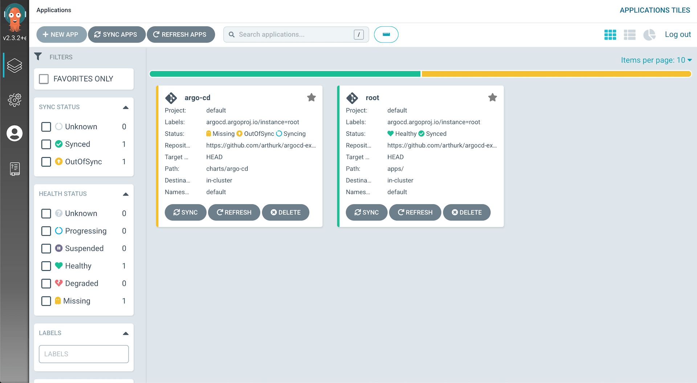

*(Updated March 27, 2022 for Argo CD v2.3)*

In this blog post we're going to setup [Argo CD](https://argo-cd.readthedocs.io/en/stable/) on a Kubernetes cluster. We'll install it with Helm, create an application to use the [app-of-apps](https://argoproj.github.io/argo-cd/operator-manual/declarative-setup/#app-of-apps) pattern, set Argo CD up so that it can update itself, and install Prometheus  via Argo CD as an example.


All files mentioned in this blog post are available in a [Git repository on GitHub](https://github.com/arthurk/argocd-example-install/).

## What is Argo CD?

[Argo CD](https://argoproj.github.io/argo-cd/) is a [GitOps](https://www.gitops.tech/) tool to automatically synchronize the cluster to the desired state defined in a Git repository. Each workload is defined declarative through a resource manifest in a YAML file. Argo CD checks if the state defined in the Git repository matches what is running on the cluster and synchronizes it if changes were detected.

For example, instead of manually running CLI commands to update Kubernetes resources with `kubectl apply` or `helm upgrade`, we would update a YAML file in our Git repository that contains an `Application` manifest. Argo CD periodically checks this manifest for changes and will automatically synchronize resources that are defined in it with the ones that are running on our cluster.

A connection to the cluster, either from the developers laptop or from a CI/CD system, is no longer needed as changes are pulled from the Git repository by a Kubernetes Operator running inside the cluster.

## Requirements

To follow this tutorial you'll need the following. The version
number shows what I've used for this tutorial:

- A Kubernetes cluster (1.23)
- kubectl (1.23.5)
- Helm (3.8.1)
- A public git repository

## Create a Git repository

Our application manifests are stored in a Git repository.
For this tutorial I'm using a public Github repo:

```
gh repo create argotest --public --clone
cd argotest
```

## Creating an umbrella Helm chart

We'll use Helm to install Argo CD with the official chart from [argoproj/argo-helm](https://github.com/argoproj/argo-helm/tree/master/charts/argo-cd). We create a Helm umbrella chart that pulls in the original Argo CD chart as a dependency.

Using this approach we have the possibility to bundle extra resources with the chart. For example, we can install credentials that are used to authenticate with private Git or Helm repositories by placing them in the chart `template/` directory.

To create the umbrella chart we make a directory in our Git repository and place two files in it:

```
mkdir -p charts/argo-cd
```

[charts/argo-cd/Chart.yaml](https://github.com/arthurk/argocd-example-install/blob/master/charts/argo-cd/Chart.yaml)

```
apiVersion: v2
name: argo-cd
version: 1.0.0
dependencies:
  - name: argo-cd
    version: 2.11.0
    repository: https://argoproj.github.io/argo-helm
```

[charts/argo-cd/values.yaml](https://github.com/arthurk/argocd-example-install/blob/master/charts/argo-cd/values.yaml)

```
argo-cd:
  dex:
    enabled: false
  server:
    extraArgs:
      - --insecure
    config:
      repositories: |
        - type: helm
          name: argo-cd
          url: https://argoproj.github.io/argo-helm
```

All available options can be found in the chart [values.yaml file](https://github.com/argoproj/argo-helm/blob/master/charts/argo-cd/values.yaml). But keep in mind that for our subchart all values must be set below the `argo-cd:` key.

For this tutorial we override the following values:

- We disable the `dex` component that is used for integration with external auth providers
- We start the server with the `--insecure` flag to serve the Web UI over http (This is assuming we're using a local k8s server without TLS setup)
- We add the Argo CD Helm repository to the repositories list to be used by applications
- The password for the admin user is set to `argocd`

Before we install the chart we need to generate a `Chart.lock` file:

```
helm repo add argo-cd https://argoproj.github.io/argo-helm
helm dep update charts/argo-cd/
```

This will generate two files: 

- `Chart.lock`
- `charts/argo-cd-4.2.2.tgz`

The `tgz` file is the downloaded dependency and not required in our Git repository, we can therefore exclude it. Argo CD will download the dependencies by itself based on the `Chart.lock` file.

We exclude it by creating a `.gitignore` file in the chart directory:

```
echo "charts/" > charts/argo-cd/.gitignore
```

The chart is now ready to push to our Git repository:

```
git add charts/argo-cd
git commit -m 'add argo-cd chart'
git push
```

## Installing our Argo CD Helm chart

We install Argo CD manually via the Helm CLI:

```
helm install argo-cd charts/argo-cd/
```

## Accessing the Web UI

The Helm chart doesn't install an Ingress by default, to access the Web UI we have to port-forward to the `argocd-server` service:

```
kubectl port-forward svc/argo-cd-argocd-server 8080:443
```

We can then visit [http://localhost:8080](http://localhost:8080) to access it. 

The default username is `admin`. The password is auto-generated and we can get it with:

```
kubectl get secret argocd-initial-admin-secret -o jsonpath="{.data.password}" | base64 -d
```

After logging in we'll see the following screen:


In practice Argo CD applications could be added through the Web UI or CLI, but since we want to manage everything declaratively we'll write `Application` manifests in YAML and put them into our Git repo.

## The root app

To add an application to Argo CD we need to add an `Application` resource to Kubernetes. It specifies the Git repository and the file path under which to find the manifests.

For example, if we wanted to deploy [Prometheus](https://prometheus.io/) we would write an `Application` manifest for it. It would specify what Helm chart to use and what values to set. We would then apply the `Application` manifest with `kubectl` and wait for the resource to be created in the cluster.

However, applying the manifests with `kubectl` is a manual step that's error prone and insecure. We would also need to repeat it for every application, not just when adding applications but also when updating them.

With Argo CD there is a way to automate adding Applications by creating an application that implements the [app of apps](https://argo-cd.readthedocs.io/en/stable/operator-manual/declarative-setup/#app-of-apps) pattern. We call this the "root" application.

The root application has one task: it generates `Application` manifests for other applications. Argo CD will watch the root application and synchronize any applications that it generates.

With this setup we only have to add one application manually: the root application.

## Creating the root app

For the root application we'll use Helm and create a Helm chart that has `Application` manifests as templates.

We create it in an `apps/` directory and put a `Chart.yaml` file and an empty `values.yaml` file in it. In our git repo we run:

```
mkdir -p apps/templates
touch apps/values.yaml
```

[apps/Chart.yaml](https://github.com/arthurk/argocd-example-install/blob/master/apps/Chart.yaml)

```
apiVersion: v2
name: root
version: 1.0.0
```

We create the `Application` manifest for our root application in `apps/templates/root.yaml`. This allows us to do any updates to the root application itself through Argo CD:

[apps/templates/root.yaml](https://github.com/arthurk/argocd-example-install/blob/master/apps/templates/root.yaml):

```
apiVersion: argoproj.io/v1alpha1
kind: Application
metadata:
  name: root
  finalizers:
  - resources-finalizer.argocd.argoproj.io
spec:
  destination:
    server: https://kubernetes.default.svc
    namespace: default
  project: default
  source:
    path: apps/
    repoURL: https://github.com/arthurk/argocd-example-install.git
    targetRevision: HEAD
  syncPolicy:
    automated:
      prune: true
      selfHeal: true
```

The above `Application` watches the Helm chart under `apps/` (our root application) and synchronizes it if changes were detected.

How does Argo CD know our application is a Helm chart? It looks for a `Chart.yaml` file under `path` in the Git repository.

**Note**: Argo CD will not use `helm install` to install charts. It will render the chart with `helm template` and then apply the output with `kubectl`. This means we can't run `helm list` on a local machine to get all installed releases.

To deploy our root application we need to push the files to our Git repository and apply the manifest:

```
git add apps
git ci -m 'add root app'
git push

helm template apps/ | kubectl apply -f -
```

In the Web UI we can now see that the root application was created successfully:


## Letting Argo CD manage itself

We previously installed Argo CD with `helm install` which means that updates to Argo CD itself would require us to run `helm upgrade` manually. To avoid doing this we can create an Application resource for Argo CD and let it manage itself.

With this approach any updates to our Argo CD deployment can be made by modifying files in our Git repository rather than running manual commands.

We put the application manifest in `apps/templates/argo-cd.yaml`:

[apps/templates/argo-cd.yaml](https://github.com/arthurk/argocd-example-install/blob/master/apps/templates/argo-cd.yaml):

```
apiVersion: argoproj.io/v1alpha1
kind: Application
metadata:
  name: argo-cd
  namespace: default
  finalizers:
  - resources-finalizer.argocd.argoproj.io
spec:
  destination:
    server: https://kubernetes.default.svc
    namespace: default
  project: default
  source:
    path: charts/argo-cd
    repoURL: https://github.com/arthurk/argocd-example-install.git
    targetRevision: HEAD
  syncPolicy:
    automated:
      prune: true
      selfHeal: true
```

Then push the file to our Git repository:

```
git add apps/templates/argo-cd.yaml
git ci -m 'add argo-cd application'
git push
```

In the Web UI we should now see the root application being `OutOfSync` and `Syncing`. 

If it doesn't show the application immediately, click the "Refresh" button on the root application. By default it checks for changes in the Git repository every 3 minutes.



Once the Argo CD application is synced it can now manage itself and we can delete the previously manually installed (via `helm install`) installation. The following command will not delete Argo CD from the cluster, only let Helm know that it is not managing Argo CD anymore:

```
kubectl delete secret -l owner=helm,name=argo-cd
```

When listing helm releases it should now show an empty list:

```
$ helm list

NAME	NAMESPACE	REVISION	UPDATED	STATUS	CHART	APP VERSIONCE	REVISION
```

## Example: Installing Prometheus

To demonstrate how to deploy a Helm chart with Argo CD, we'll add [Prometheus](https://prometheus.io/) to our cluster. 

First we create an `Application` manifest in `apps/templates/prometheus.yaml` that uses the [Prometheus helm chart](https://github.com/prometheus-community/helm-charts/tree/main/charts/prometheus).

[apps/templates/prometheus.yaml](https://github.com/arthurk/argocd-example-install/blob/master/apps/templates/prometheus.yaml)

```
apiVersion: argoproj.io/v1alpha1
kind: Application
metadata:
  name: prometheus
  namespace: default
  finalizers:
  - resources-finalizer.argocd.argoproj.io
spec:
  destination:
    server: https://kubernetes.default.svc
    namespace: default
  project: default
  source:
    chart: prometheus
    helm:
      values: |
        pushgateway:
          enabled: false
    repoURL: https://prometheus-community.github.io/helm-charts
    targetRevision: 15.6.0
  syncPolicy:
    automated:
      prune: true
      selfHeal: true
```

Compared to our previously created Argo CD umbrella chart, the differences are:

- We're using `chart` instead of `path` to install a Helm chart from a different Helm repository
- The `targetRevision` is the specific chart version that we want to install
- The `repoURL` is set to the [prometheus-community](https://github.com/prometheus-community/helm-charts/) Helm chart repository
- We're overriding the chart default [values](https://github.com/prometheus-community/helm-charts/blob/main/charts/prometheus/values.yaml) to disable the pushgateway

To deploy the application all we have to do is push the manifest to our Git repository:

```
git add apps/templates/prometheus.yaml
git ci -m 'add prometheus'
git push
```

Prometheus should show up in the Web UI after the next refresh. 


## Example: Uninstall Prometheus

To uninstall Prometheus we just have to delete the previously added `prometheus.yaml` file from out Git repo:

```
git rm apps/templates/prometheus.yaml
git ci -m 'remove prometheus'
git push
```

The application will be removed from the cluster after the next refresh.

## Conclusion

In this tutorial we've installed Argo CD with Helm and set it up so that it can manage itself. Updates to Argo CD can be done by modifying the manifest inside the Git repository and don't require any manual steps.

We've created a root application that uses the [app-of-apps](https://argo-cd.readthedocs.io/en/stable/operator-manual/declarative-setup/#app-of-apps) pattern to manage our applications in a declarative way.

Applications can be added, updated or removed with Git. As an example we've installed Prometheus in our cluster.

More details about Argo CD can be found on the [project page](https://argo-cd.readthedocs.io/en/stable/) and the [GitHub repository](https://github.com/argoproj/argo-cd/).
