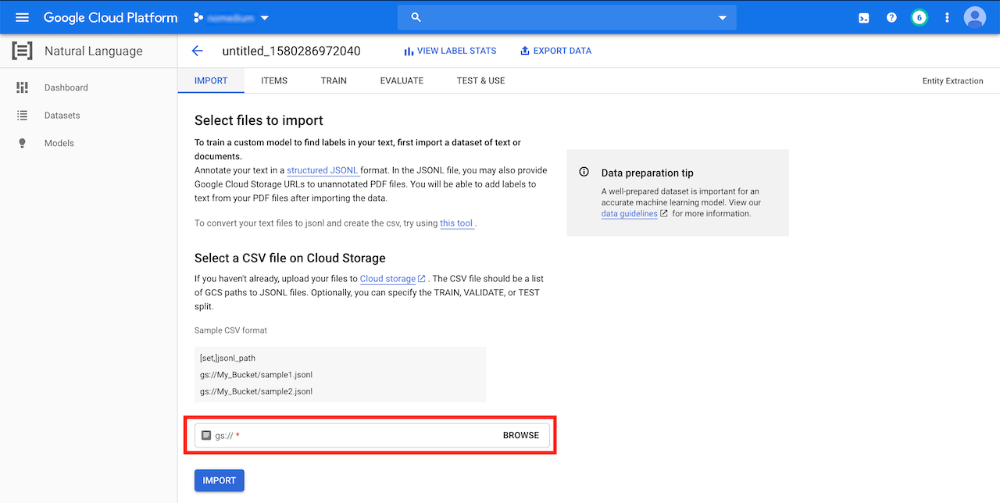
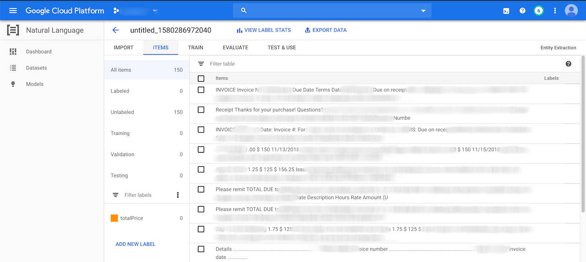
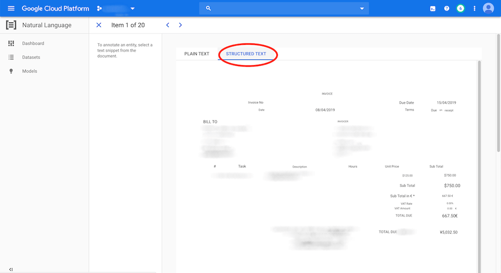
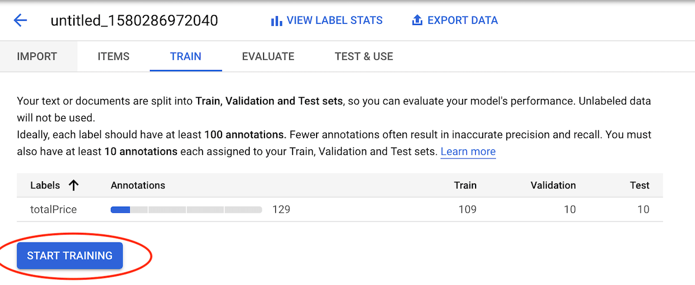
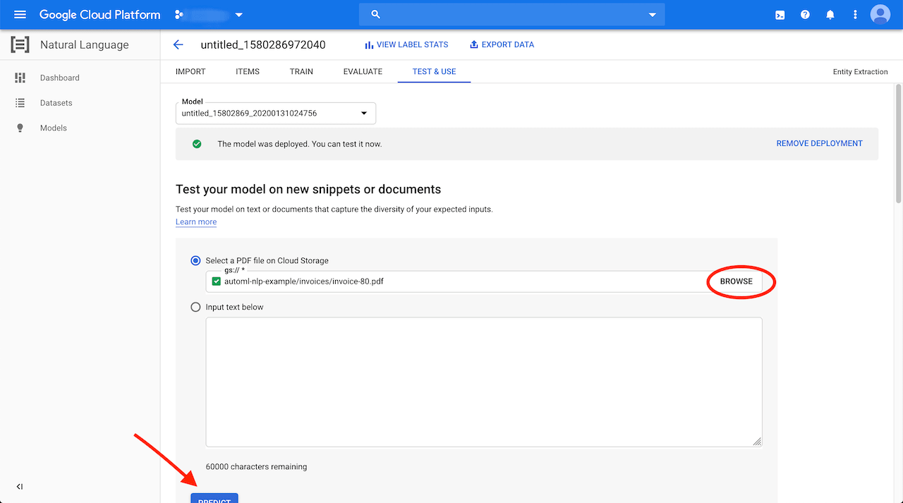

+++
title = "Extracting Data from Invoices with Google AutoML Natural Language"
date = "2020-02-02"
+++

In this tutorial I will show how to use [Google AutoML Natural Language](https://cloud.google.com/natural-language/automl/docs/) to setup a machine learning model that will automatically extract the total from invoices.

Why?
----

Manually extracting data from invoices and entering them into an accounting system is time-consuming and tedious work.

To automate this there are template-based systems like [invoice2data](https://github.com/invoice-x/invoice2data) available. They extract the data using predefined extraction rules (regular expressions):

```
Invoice Total: \$(\d+.\d{2})
```

With such a system there's still manual work required. YAML templates with extraction rules need to be written for each supplier and then maintained as invoice structures change over time. In the example above the supplier could decide to change `Invoice Total` to `Total` on the next invoice. The extraction would fail and the rule would have to be adjusted.

A better solution is to use a machine learning model that can extract the information without writing extraction rules. In this post I'm going to show how to setup such a model.

Steps To Do
-----------

To build our invoice data extraction ML model we have to do the following steps:

*   Collect the training documents
*   Upload the documents to Google Cloud Storage
*   Create a CSV and JSONL file for AutoML to import the uploaded documents
*   Import the documents
*   Annotate the documents
*   Build/Train the model

After that we can manually test the model by uploading invoices and checking how well it's able to extract the data.

I'm using Google AutoML Natural Language which is part of Google Cloud Platform and a GCP account is required. Regarding cost there are two things to note: Google will give $300 free credit for new GCP accounts and $25 promotional credit for developers using AutoML for the first time.

Note that for the `gsutil` commands below I installed the [Google Cloud SDK](https://cloud.google.com/sdk/) but it's not necessary to do so, the GCS operations from below can also be done over the Web UI.

Training Documents
------------------

The first step is to collect training documents that are structured in the same way as the documents we want the model to handle later on. I was able to collect 150 invoices from different consultants. All invoices are text based PDF files with either 1 or 2 pages and the total written somewhere in the bottom right (single page invoices) or top-right (two-page invoices).

This is almost the minimum amount of training documents that is required by AutoML to work. Feel free to add more. The more training documents the better the model's performance.

It's important to use documents that have a similar structure. AutoML will use those documents to build the model by trying out different algorithms to find patterns. If those documents are structured differently it won't be able to find any patterns and the model will have a poor performance.

Uploading Documents to GCS
--------------------------

All documents need to be stored in a Google Cloud Storage (GCS) bucket. AutoML doesn't support other document sources. There are three important restrictions when creating the bucket:

*   The _Location Type_ has to be `Region`
*   The _Location_ has to be `us-central1 (Iowa)`
*   The _Storage Class_ has to be `Standard`

The bucket can be created by running:

```
gsutil mb -l us-central1 gs://automl-nlp-example
```

I have all my training documents in a folder called `invoices/` and named with the same pattern: `invoice-X` where X is the number of the invoice (1 to 150). I recommend using the same pattern for all the invoice files as we will need to iterate over them later on. We can upload the folder with the invoices by running:

```
gsutil -m cp -r invoices/ gs://automl-nlp-example/
```

Importing the documents
-----------------------

For AutoML to be able to import the training documents we need to create a CSV file. The CSV file contains a link to a [JSONL](http://jsonlines.org/) document and the JSONL file then contains links to the actual invoice PDF files. The files are imported in the following way:

AutoML -> CSV file → JSONL file → PDF file(s)

Creating the CSV file
---------------------

Creating the CSV file is simple and requires only one line:

```
,gs://automl-nlp-example/data.jsonl
```

It's important to have the comma at the beginning of the line which will make AutoML randomly assign the documents to different sets (TRAIN, VALIDATION, TEST). It will use:

*   80% of the PDF documents for training the model
*   10% for validating the results during training
*   10% for verifying the model's results after it has been trained

We can upload the CSV file to GCS:

```
gsutil cp data.csv gs://automl-nlp-example/
```

Creating the JSONL File
-----------------------

The JSONL file contains links to the invoice PDF documents. Each line links to one PDF document and needs to have the following structure:

```json
{"document": {"input_config": {"gcs_source": {"input_uris": [ "gs://automl-nlp-example/invoice-1.pdf" ]}}}}
```

We need to repeat this line for all documents and change the value of `input_uris` to use the actual filename of the PDF file. I used a small Python script to generate the file (this is easy since my documents follow the same filename pattern) and upload it to GCS:

```
python3 -c 'for x in range(1, 151): print("""{"document": {"input_config": {"gcs_source": {"input_uris": [ "gs://automl-nlp-example/invoice-%s.pdf" ]}}}}""" % x)' > data.jsonl
gsutil cp data.jsonl gs://automl-nlp-example/
```

Now we should have the following files in the GCS bucket:

*   The `invoice/` directory contains all invoices as PDF files
*   The `data.csv` file contains a link to the JSONL file
*   The `data.jsonl` file contains links to the PDF files

Creating the AutoML Dataset
---------------------------

We can start creating the dataset in the GCP console. Go to _Natual Language_ and then _AutoML Entity Extraction_ to create the dataset. The location has to be _Global_ and the model objective has to be _Entity Extraction_:


The CSV file can be imported from the GCS bucket at the bottom of the screen:



In my case the import process took _13 minutes_ to finish.



I created a `totalPrice` label. We can do this in the bottom by clicking on "_Add New Label_". We will use that label in the next step to annotate the entity we want to extract.

Annotating the Documents
------------------------

Annotating the documents is the most time-consuming part. We need to go through the following number of invoice documents in each set and mark the total in them:

*   100 documents in the Training set
*   10 documents in the Validation set
*   10 documents in the Test set

This is the minimum number of annotations to make the model train. Feel free to annotate more documents if there's time.

Next we click on a document and navigate to the _Structured Text_ view which. This will show the content of the PDF file and make it easy to annotate by simply selecting the text with the mouse and picking a label in the overlay popup. In the example below I would annotate the total: `5,032.50`



When using this view AutoML will use the PDFs annotation's position during training and learn to distinguish between entities based on the position of the annotation.

After all the documents have been annotated we can switch to the "TRAIN" tab and start the training:



In my case the training process took _2 hours and 18 minutes_ to finish.

Manual Testing
--------------

After we trained the model we can try it out by uploading an invoice to GCS:

```
gsutil cp testing-invoice.pdf gs://automl-nlp-example/
```

Then selecting it in the "TEST & USE" tab and clicking on the "PREDICT" button:



The prediction will only take a second and shows the result in a PDF view:


In the example above we can see that the `totalPrice` was successfully extracted. Feel free to try it out with other invoices. Multiple documents can be submitted by using the [Batch prediction REST API](https://cloud.google.com/natural-language/automl/docs/predict#batch_prediction).

Conclusion
----------

I found Google AutoML Natural Language easy to use. Most of the tasks (except creating the CSV and JSONL files) can be done in the Web UI and the whole process doesn't require any coding experience. I only had a very small training dataset available but the results are good enough. In my manual tests I was able to extract the total in around 80% of the cases. I'm sure this could be improved by making a higher quality training dataset. The downside is that the price for AutoML is high. It cost me around $25 to train, test and deploy this model.
