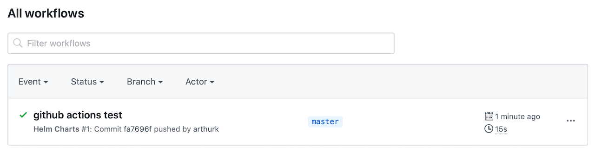
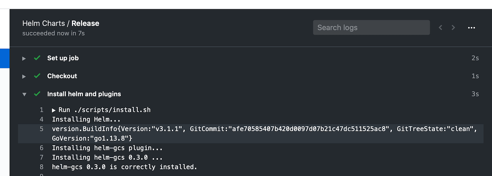
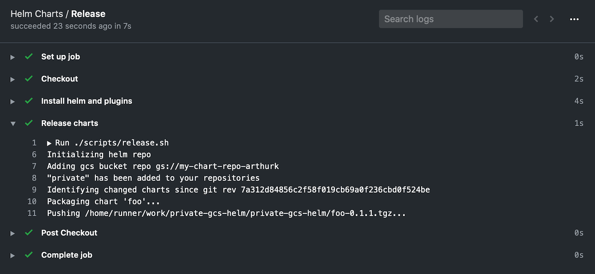

+++
title = "Private Helm Repo with GCS and GitHub Actions"
date = "2020-03-08"
+++

In this blog post I'm going to show how to setup a private Helm chart repository on Google Cloud Storage (GCS) and use GitHub Actions to automatically push charts on new commits.

## Setting up the GCS Bucket

The first step is to create a GCS bucket that will hold our charts. We can do this over the CLI with the gcloud-sdk or over the Web UI. I'm going to use the CLI for the following examples.

To make it easier to handle access permissions we use the `-b on` flag to enable uniform bucket-level access. It let's us manage permissions on a bucket-level rather than on an object-level:

```
$ gsutil mb -b on gs://my-chart-repo-arthurk
Creating gs://my-chart-repo-arthurk/...
```

For Helm to be able to push charts to this bucket we need a Cloud IAM service account (with key) with _Storage Object Admin_ permissions:

```
$ gcloud iam service-accounts create my-chart-repo-svc-acc
Created service account [my-chart-repo-svc-acc].

$ gcloud iam service-accounts keys create service-account.json --iam-account=my-chart-repo-svc-acc@PROJECT.iam.gserviceaccount.com
created key [123123123] of type [json] as [service-account.json] for [my-chart-repo-svc-acc@PROJECT.iam.gserviceaccount.com]

$ gsutil iam ch serviceAccount:my-chart-repo-svc-acc@PROJECT.iam.gserviceaccount.com:roles/storage.objectAdmin gs://my-chart-repo-arthurk
```

When referring to the service account we have to use the email (not the name) which has the format `SERVICE_ACCOUNT_NAME@PROJECT_ID.iam.gserviceaccount.com`.

## Setting up GitHub Actions

In this step we're going to setup GitHub Actions to detect charts that have changed and add them to our helm repo.

We start by creating the `.github/workflows/helm-ci.yml` file and add:

```yaml
name: Helm Charts
on: [push]

jobs:
  release:
    name: Release
    runs-on: ubuntu-latest
    steps:
      - name: Checkout
        uses: actions/checkout@v2
        with:
          fetch-depth: 2
```

By default the checkout action will clone the repo with a detached HEAD. To later compare files that have changed between the current HEAD and the previous commit we have to pass `fetch-depth: 2` to the action.

After pushing the code we can open GitHub Actions in the browser and check the workflow. It should look like this:



## Installing Helm and helm-gcs

The next step in the CI pipeline is to install Helm and the [helm-gcs plugin](https://github.com/hayorov/helm-gcs). We add the following step to our workflow:

```yaml
- name: Install helm and plugins
  run: ./scripts/install.sh
```

and then create the `scripts/install.sh` file with the following content:

```bash
#!/usr/bin/env bash

set -o errexit

HELM_VERSION=3.1.1
HELM_GCS_VERSION=0.3.1

echo "Installing Helm..."
wget -q https://get.helm.sh/helm-v${HELM_VERSION}-linux-amd64.tar.gz
tar -zxf helm-v${HELM_VERSION}-linux-amd64.tar.gz
sudo mv linux-amd64/helm /usr/local/bin/helm
helm version

echo "Installing helm-gcs plugin..."
helm plugin install https://github.com/hayorov/helm-gcs --version ${HELM_GCS_VERSION}
```

Set `chmod u+x scripts/install.sh` and push the file. We can check GitHub Actions to make sure everything installed correctly:



This shows us that Helm 3.1.1 and helm-gcs 0.3.0 have been successfully installed

## Initializing the helm repository

We can now initialize the helm repository. For this to work we need to add our previously created service account key to GitHub. To do this we navigate to the repository and click on **"Settings" → "Secrets" → "Add a new secret"**. There we set the name to be `GCLOUD_SERVICE_ACCOUNT_KEY` and as a value add the content of the service-account.json file. After saving the secret it should look like this:


We can now modify the workflow to pass the secret as an environment variable to our next shell script:

```yaml
- name: Release charts
  run: ./scripts/release.sh
  env:
    GCLOUD_SERVICE_ACCOUNT_KEY: ${{ secrets.GCLOUD_SERVICE_ACCOUNT_KEY }}
```

In the release.sh script we save the service account to a file and point the `GOOGLE_APPLICATION_CREDENTIALS` environment variable to it. This is needed for helm-gcs plugin to authenticate. Afterwards we initialize the GCS repo which will create an empty `index.yaml` file in the GCS bucket. Finally we can add the repo to helm so it can access its packages.

```bash
#!/usr/bin/env bash

set -o errexit
set -o nounset
set -o pipefail

GCS_BUCKET_NAME="gs://my-chart-repo-arthurk"

# setup service account for helm-gcs plugin
echo "${GCLOUD_SERVICE_ACCOUNT_KEY}" > svc-acc.json
export GOOGLE_APPLICATION_CREDENTIALS=svc-acc.json

# initializing helm repo
# (only needed on first run but will do nothing if already exists)</span>
echo "Initializing helm repo"
helm gcs init ${GCS_BUCKET_NAME}

# add gcs bucket as helm repo
echo "Adding gcs bucket repo ${GCS_BUCKET_NAME}"
helm repo add private ${GCS_BUCKET_NAME}
```

Before committing the file make sure to mark it as executable with `chmod u+x scripts/release.sh`.

## Packaging and Pushing changed Charts

In the final step of our CI script we need to identify which charts have changed and then package and push them to the helm repo. We do this by running `git diff` on the previous revision with the following arguments:

*   `--find-renames` detect if a file has been renamed
*   `--diff-filter=d` will ignore deleted files (we can't package/push a deleted chart)
*   `--name-only` only print the name of the changed file
*   `cut -d '/' -f 2 | uniq` we only need unique directory names of files that have changed

We add the following content to the release.sh file:

```bash
prev_rev=$(git rev-parse HEAD^)
echo "Identifying changed charts since git rev ${prev_rev}"

changed_charts=()
readarray -t changed_charts <<< "$(git diff --find-renames --diff-filter=d --name-only "$prev_rev" -- charts | cut -d '/' -f 2 | uniq)"

if [[ -n "${changed_charts[*]}" ]]; then
    for chart in "${changed_charts[@]}"; do
        echo "Packaging chart '$chart'..."
        chart_file=$(helm package "charts/$chart" | awk '{print $NF}')

        echo "Pushing $chart_file..."
        helm gcs push "$chart_file" private
    done
else
    echo "No chart changes detected"
fi
```

Commit and push the changes. After the CI run has finished, the GCS bucket will be initialized and have an `index.yaml` file in it. This file is an index of all the helm charts in the repo. As we currently have no charts indexed it has the following content:

```
$ gsutil cat gs://my-chart-repo-arthurk/index.yaml
apiVersion: v1
entries: {}
generated: "2020-03-08T06:51:49.496564824Z"</span>
```

## Releasing our first chart

We can now create and add the first chart to our helm repository. We do this by creating a _chart/_ directory and running `helm create` to create an example chart:

```
$ mkdir charts
$ helm create charts/foo
Creating charts/foo</span>
```

Add, commit and push all new files, then check GitHub Actions. It will show us that the chart was successfully packaged and pushed to the repo:



Note that it's not possible to push the same chart version to the same repo. The push will fail. We need to always make sure to increase the `version` value in the `Chart.yaml` file when releasing a new chart.

## Trying it out

To try out our private helm repo we can add it to helm on our client machine and list the repo contents:

```
$ helm plugin install https://github.com/hayorov/helm-gcs
$ gcloud auth application-default login
$ helm repo add private-repo gs://my-chart-repo-arthurk
$ helm repo update
$ helm search repo private-repo -l
NAME            	CHART VERSION	APP VERSION	DESCRIPTION
private-repo/foo	0.1.0        	1.16.0     	A Helm chart for Kubernetes</span>
```

As you can see the chart was successfully added to the registry. It can now be used as any other chart, for example by installing it with `helm install private-repo/foo --version 0.1.0`.

The source code for all examples is available [in this GitHub repo](https://github.com/arthurk/private-gcs-helm).
