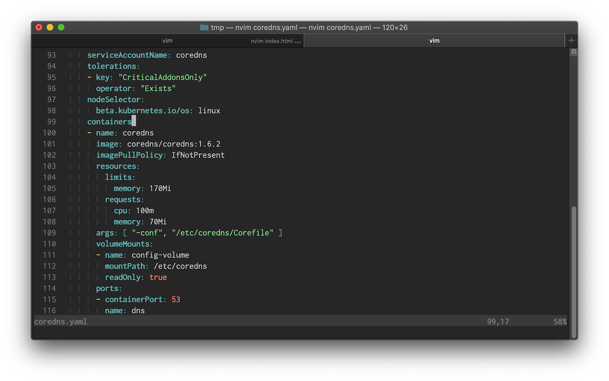
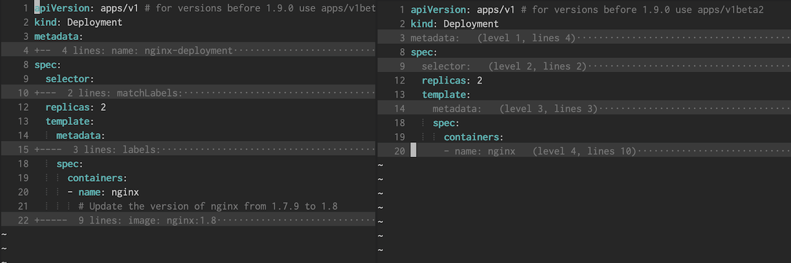

+++
title = "Setting up Vim for YAML editing"
date = "2020-03-23"
+++

In this blog post I'm going to show how to set up Vim for easier YAML editing.


You can scroll down to the end for a summary of all installed plugins and config file changes.

## Syntax Highlighting

There's not much to do here. VIM has YAML syntax highlighting built-in and it's great.

A few years back YAML highlighting in Vim was very slow, and there was often a noticeable lag when opening large files. The workaround was to use the [vim-yaml](https://github.com/stephpy/vim-yaml) plugin for fast syntax highlighting.

I decided to make a performance benchmark. I loaded up a [large YAML file](https://github.com/istio/istio/blob/master/manifests/base/files/gen-istio-cluster.yaml) (6100 lines) and compared the time:

```
# default syntax highlighting
$ vim gen-istio-cluster.yaml --startuptime default.log
$ tail -1 default.log
055.563

# vim-yaml plugin
$ vim gen-istio-cluster.yaml --startuptime vimyaml.log
$ tail -1 vimyaml.log
060.320
```

As we can see the default syntax highlighting is just as fast as the plugin and there's no need to install a separate plugin to fix the slow syntax highlighting anymore.

## Indentation

Indentation probably the most annoying part about editing YAML files. Large documents with deeply nested blocks are often hard to track and errors are easily made.

YAML documents are required to have a 2 space indentation. However, Vim does not set this by default but it's an easy fix by putting the following line in the vim config:

```vim
autocmd FileType yaml setlocal ts=2 sts=2 sw=2 expandtab
```

We can also setup Indentation guides. Indentation guides are thin vertical lines at each indentation level and useful to help line up nested YAML blocks.

We can display those lines by using the [indentLine plugin](https://github.com/Yggdroot/indentLine). I've modified the indentation character to display a thinner line (default is "¦"):

```vim
let g:indentLine_char = '⦙'
```

The result should look like this:



## Folding

With folding we can hide parts of the file that are not relevant to our current task.

Vim has built-in support for folding based on the indentation level but the default folding rules make it hard to tell what is folded. This is because the folding starts on the line _following_ the start of a block. To change this we can install the [vim-yaml-folds](https://github.com/pedrohdz/vim-yaml-folds) plugin.

Here's a side-by-side comparison of the default folding (left) compared to vim-yaml-folds (right):



To work with folding we need to remember a few keyboard commands. Vimcasts has a great episode on this [here](http://vimcasts.org/episodes/how-to-fold/). Most of the time I use the following commands:

*   za: Toggle current fold
*   zR: Expand all folds

After the plugin is installed and folding is enabled the default settings will fold all blocks by default. To start with unfolded content we can set:

```vim
set foldlevelstart=20
```

There's also a plugin called [restore_view](https://www.vim.org/scripts/script.php?script_id=4021) which will save the folds for each file. But be aware that this plugin will create an extra file with folding information for each opened document.

## Linting

Linting will analyze the code and show any potential errors while we're writing it which helps us catch formatting or syntax errors early on.

To do this in Vim we can use [ALE](https://github.com/dense-analysis/ale), an asynchronous linting framework that has support for many languages and tools including YAML. To enable YAML linting in ALE we have to install [yamllint](https://github.com/adrienverge/yamllint), a Python-based YAML linter.

Installation instructions are [here](https://yamllint.readthedocs.io/en/stable/quickstart.html#installing-yamllint). On macOS we can install it with Homebrew:

```
$ brew install yamllint
```

The default configuration is fairly strict and shows errors in document style such as line length, trailing spaces or comment indentation.

We can modify the configuration to be less strict. Yamllint already comes with a [relaxed](https://github.com/adrienverge/yamllint/blob/master/yamllint/conf/relaxed.yaml) version of the default config that is a good starting point. The only additional thing I've decided to disable is line length checking.

To do this we open up `~/.config/yamllint/config` and paste the following:

```yaml
extends: relaxed

rules:
  line-length: disable
```

I've modified the ALE configuration to change the message format, error symbols and only lint when the file is saved:

```vim
let g:ale_echo_msg_format = '[%linter%] %s [%severity%]'
let g:ale_sign_error = '✘'
let g:ale_sign_warning = '⚠'
let g:ale_lint_on_text_changed = 'never'
```

We can see the errors and warnings on the left side:


## Summary

Here's a summary of the plugins, applications and config modifications:

### Vim Plugins

*   [indentLine](https://github.com/Yggdroot/indentLine)
*   [vim-yaml-folds](https://github.com/pedrohdz/vim-yaml-folds)
*   [ALE](https://github.com/dense-analysis/ale)

### Applicatins

*   [yamllint](https://github.com/adrienverge/yamllint)

### Config

In `~/.vimrc` or `~/.config/nvim/init.vim`

```vim
autocmd FileType yaml setlocal ts=2 sts=2 sw=2 expandtab

set foldlevelstart=20

let g:ale_echo_msg_format = '[%linter%] %s [%severity%]'
let g:ale_sign_error = '✘'
let g:ale_sign_warning = '⚠'
let g:ale_lint_on_text_changed = 'never'
```

In `~/.config/yamllint/config`

```yaml
extends: relaxed

rules:
  line-length: disable
```
