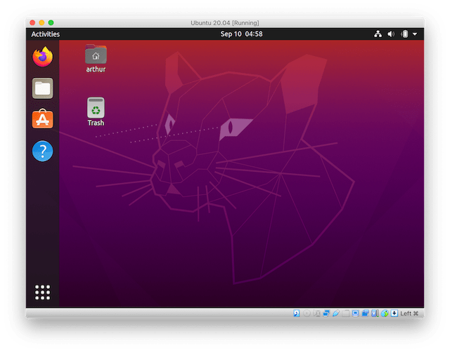

+++
title = "Using the VBoxManage CLI to create a Ubuntu 20.04 VM"
+++

This tutorial describes the installation of Ubuntu 20.04 in VirtualBox by using the [VBoxManage CLI](https://www.virtualbox.org/manual/ch08.html).



I'm assuming that [VirtualBox 6.1](https://www.virtualbox.org/) is installed, the VBoxManage CLI is ready to use and the [Ubuntu 20.04 ISO](https://ubuntu.com/download/desktop) has been downloaded.

I've tested this on an apple laptop with retina (HiDPI) display and included instructions to scale the display output. The scaling commands can be ignored for non-HiDPI displays.

Getting started
---------------

We first create the VM and increase the hardware resources. The default settings use 1 CPU core, 128MB RAM and 8MB VRAM which is not enough. We'll increase it to use 2 CPU cores, 4GB RAM and 128MB VRAM:

```
$ VBoxManage createvm --name "Ubuntu 20.04" --ostype Ubuntu_64 --register
$ VBoxManage modifyvm "Ubuntu 20.04" --cpus 2 --memory 4096 --vram 128 --graphicscontroller vmsvga --usbohci on --mouse usbtablet
```

In the above command I've also enabled USB and set the Graphics Controller to VMSVGA which is the default controller when using the GUI but set to the legacy VBoxVGA when using the CLI.

To see all available options run `VBoxManage modifyvm` which will output a list of all flags. The current values can be seen with `VBoxManage showvminfo "Ubuntu 20.04"`.

Storage Devices
---------------

Next we need to configure the storage devices. We create an empty 20GB hard drive that we can install Ubuntu on. A minimal Ubuntu installation takes about 5GB of space:

```
$ VBoxManage createhd --filename ~/VirtualBox\ VMs/Ubuntu\ 20.04/Ubuntu\ 20.04.vdi --size 20480 --variant Standard
$ VBoxManage storagectl "Ubuntu 20.04" --name "SATA Controller" --add sata --bootable on
$ VBoxManage storageattach "Ubuntu 20.04" --storagectl "SATA Controller" --port 0 --device 0 --type hdd --medium ~/VirtualBox\ VMs/Ubuntu\ 20.04/Ubuntu\ 20.04.vdi 
```

We also create a dvd drive with the Ubuntu ISO mounted in it. The VM will boot from this drive first when starting:

```
$ VBoxManage storagectl "Ubuntu 20.04" --name "IDE Controller" --add ide
$ VBoxManage storageattach "Ubuntu 20.04" --storagectl "IDE Controller" --port 0 --device 0 --type dvddrive --medium ~/Downloads/ubuntu-20.04.1-desktop-amd64.iso
```

Display output scaling
----------------------

The Ubuntu installer runs with a resolution of 800x600 and would look tiny on HiDPI screens if we wouldn't scale up the display output. The following command will scale up the display output by a factor of 2:

```
$ VBoxManage setextradata "Ubuntu 20.04" GUI/ScaleFactor 2
```

Start the VM
------------

Now we can start the VM which will load the Ubuntu GUI installer from the mounted ISO:

```
$ VBoxManage startvm "Ubuntu 20.04"
```

After the installation is done the installer will prompt to remove the installation media. We can ignore this for now and press enter to reboot.

When Ubuntu is booted up we install the VirtualBox Guest Additions to get the display drivers. This can be done by clicking on the menu bar and selecting "Devices", then "Insert Guest Additions CD Image". The installer will start automatically.

Finishing the installation
--------------------------

After the Guest Additions are installed we can let GNOME handle the display output scaling which has a better quality.

In the Ubuntu terminal (right click on Desktop and select "Open in Terminal") enter:

```
$ gsettings set org.gnome.desktop.interface scaling-factor 2
```

We can now shut down the VM to remove the installation media and disable the VirtualBox display scaling. On the Desktop click on the arrow in the top right corner and select "Power Off". Then run the following command on the host:

```
$ VBoxManage storageattach "Ubuntu 20.04" --storagectl "IDE Controller" --port 0 --device 0 --type dvddrive --medium emptydrive
$ VBoxManage setextradata "Ubuntu 20.04" GUI/ScaleFactor 1
```

With that done the Ubuntu VM is ready to use.

Conclusion
----------

We created a Ubuntu 20.04 VM by using the CLI instead of the GUI wizard. Personally I find this useful since I sometimes forget to set values in the GUI (such as increasing the VRAM). The Ubuntu Desktop installer has to run in a GUI, to automate this we'd need to use the Ubuntu Server ISO and install the GNOME desktop manually.
