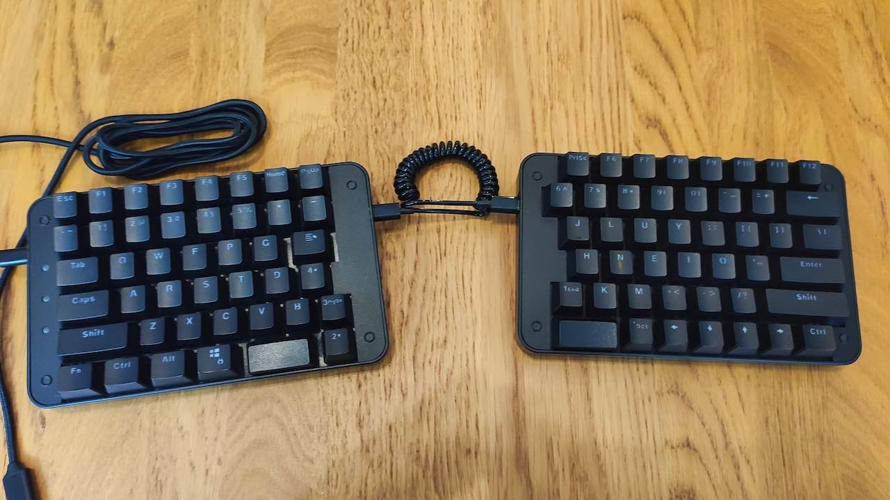
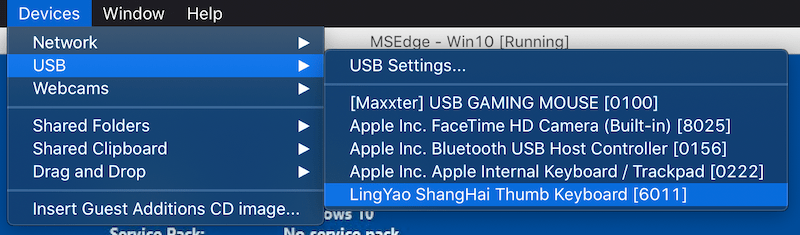
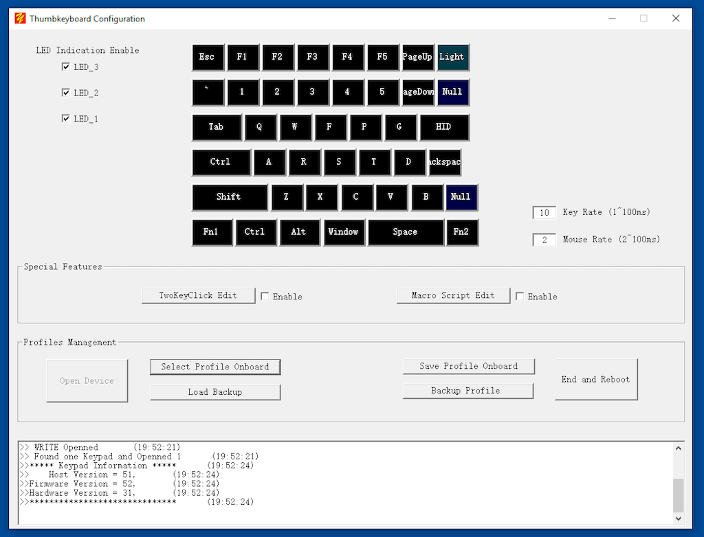
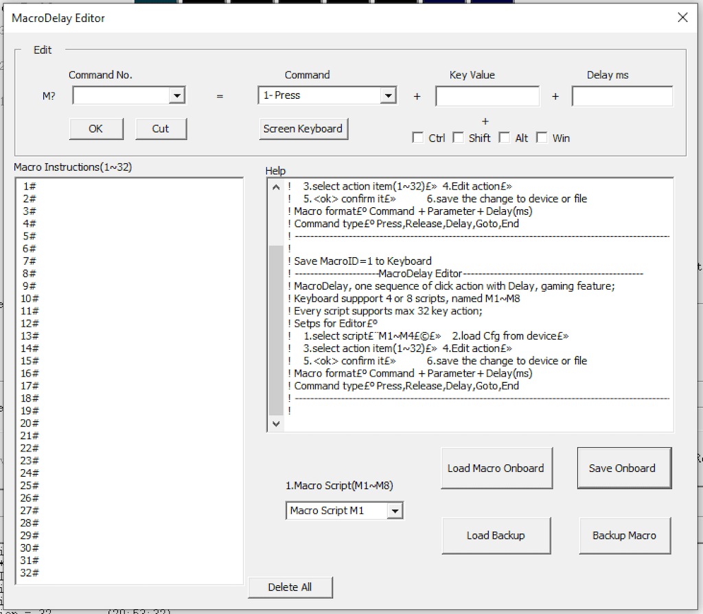
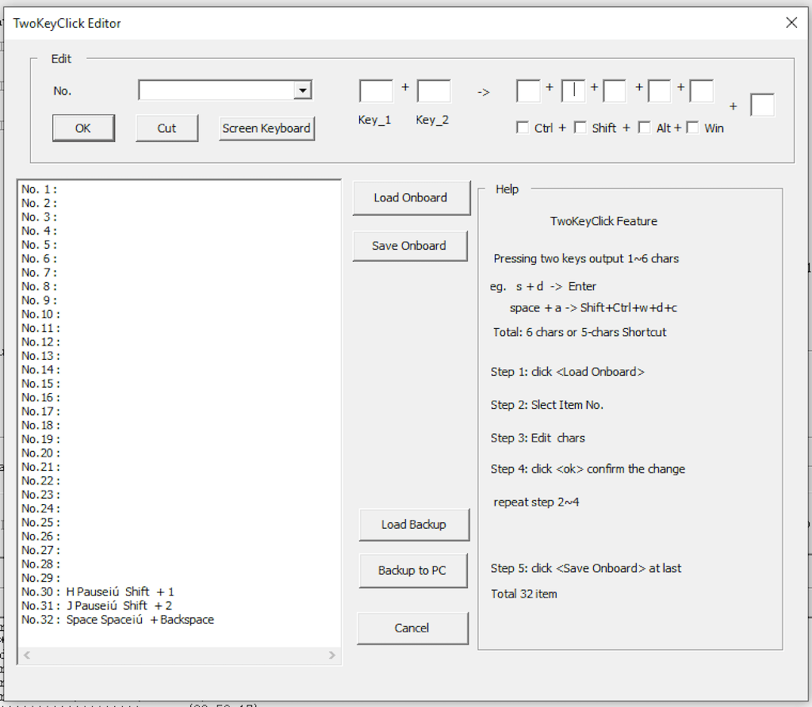
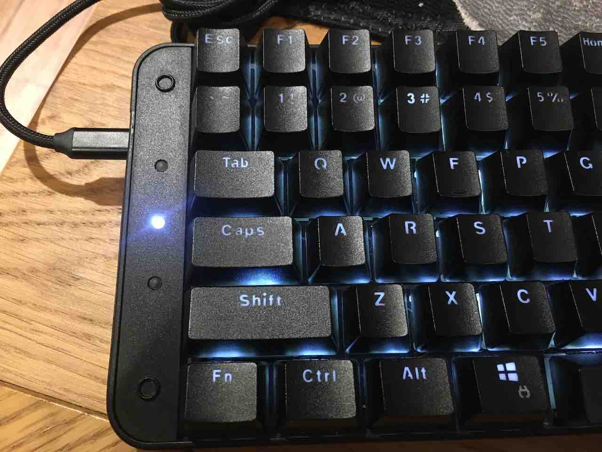

+++
title = "Smartyao LY092 Keyboard Review"
+++

This blog post is a review of the [Smartyao](http://www.smartyao.com/?_l=en) LY092 Split-Keyboard which I've been using for the past 7 months. 

I bought this split-keyboard to improve ergonomics since it allows typing at shoulder width rather than having to hunch over the keyboard.

This is my first mechanical keyboard in over 10 years and also my first split keyboard. I wasn't sure if I'd like split keyboards and didn't want to spend $350 on an ErgoDox, so I decided to try this one out. 

I bought it on [Taobao](http://shop114100401.taobao.com/?spm=2013.1.1000126.2.MloYHY&v=1) in China for 458 RMB (around $70 USD). There's a rebranded version (Koolertron) available on [Amazon](https://www.amazon.com/Koolertron-Programmable-Mechanical-Keyboard-Ergonomic/dp/B081GX5CY1) although it costs more than double the original price.

## Hardware

The keyboard has 43 keys on the left half and 45 keys on the right half. It can be ordered with either Cherry MX (Brown or Red) or Gateron (Blue or Black) switches. I've picked the Cherry MX Brown. Extra key caps with Numpad labels are included in the package and the existing keys can be swapped out.

The letters and numbers on the key caps are engraved so there's no need to worry about them wearing off. The letters are see-through which is nice with the background lighting. Each side of the keyboard has 2 Micro USB connections. The middle ones are for connecting the two halves with each other. The left side or right side can be connected to the computer USB port with the included Micro USB to USB adapter.

The background light is white and can be turned on/off by pressing the top right key on the left side and top left key on the right side (each side has to be turned off separately). The key for turning the light on/off can be programmed in the configuration software.

## Configuration Software

The keyboard is programmable which means that each key can be assigned a different value or alternatively use of one of the built-in functions. I've described some of those functions below. For a full reference of what the keyboard is capable to do check the [User Manual](https://dme657285d3.pic11.websiteonline.cn/upload/Thumbkeyboard_User_Manual_V5.pdf).

### Installation

The software can be downloaded from the [manufacturer's website](http://www.smartyao.com/page91?_l=en). It's only available for Windows but I was able to run it without problems on macOS via VirtualBox. I used the [MSEdge on Win10 trial](https://developer.microsoft.com/en-us/microsoft-edge/tools/vms/) version of Windows 10.

VirtualBox disables all USB connections by default. The keyboard needs to be connected via the menu before it can be used. It shows up under `Devices -> USB` as `LingYao ShangHai Thumb Keyboard`:

Each keyboard-side has to be programmed separately. It has to be put into a configuration mode by holding down the top-left key (for example `ESC` on the left side) while connecting it to the USB port. The LEDs will start blinking to indicate that it is now in config mode. On launch the configuration software will automatically load the default profile.

### Overview

The following picture shows the default view after loading the left side of the keyboard into the config software:

Each key can be programmed individually by clicking on it and selecting a new value with the virtual keyboard:

## Functions

Besides assigning a new char to a key there are also a few functions that can be used:

- **3-Layer Keymap**: Use a different char for a key when `FN1` or `FN2` is pressed. For example `FN1+H` can be mapped to `Left Arrow`. 
- **Hotkey**: Use one key press to send a shortcut such as `Ctrl+C`, another key to send `Ctrl+V`. This is a useful function to implement copy/paste/cut/undo/redo with a single key press
- **Burst**: Send up to 3 chars with a single click. Useful to output a pair of braces `[]` with a single press
- **Mouse**: Control (move, click, ...) the mouse with the keyboard. For example a key press can move the mouse by 200px to the left
- **Round-Robin**: Output a different char on every key press. Up to 3 chars can be chosen
- **Continue**: Simulates a key-hold when a key is pressed the first time and a key-release when it's pressed again. Gaming-feature to make it easier to walk around without continuously holding down the key
- **Jitter**: One key press to continuously output up to 3 chars. Like the Burst function but will continue doing so until the key is pressed again

There are also special functions to turn the Backlights ON/OFF, Switch Profiles and execute Macros.

## Macros

Macros are scripts that can be programmed to do a series of key presses or mouse movements with a short delay between them:

Each keyboard can save 8 macros saved with each Macro being able to press up to 32 keys.

## TwoKeyClick

The TwoKeyClick function enables sending up to 6 characters when two keys are pressed simultaneously. For example pressing `A+S` at the same time can send `Enter` or pressing `J+K` can send `ESC`.

During my testing I found this hard to trigger since the keys have to be pressed at exactly the same time. There's a workaround by using the Burst Function to send two chars with a single key press and then using those same two chars to run the TwoKeyClick function.

## Profiles

A profile is a mapping of keys. For example the `A` key could output a different char (or run a function) in each profile. Each side of the keyboard has 4 profiles (Default Profile and Profile 1-3).

The LEDs on the left side of the keyboard show which profile is currently active. On the right side of the keyboard the background light of the F11 and F12 keys shows the currently active profile. 

I found this function useful to try out different keyboard layouts such as Dvorak, Colemak and Workman. 

## Conclusion

Overall I'm happy with the keyboard. I've been using it daily for the past 7 months. For a split keyboard it's cheap (compared to ErgoDox) and built very well. I'm sure it will last a long time. The software is easy to use and allows each key to be assigned a different char (for example to use a different keyboard layout) or use one of the built-in functions to enable extra keys or shortcuts. 

Pros:

- Good price for a split-keyboard
- Great build quality
- Easily programmable with many functions to choose from

Cons:

- Software is only available for Windows
- Each side has to be connected separately to be programmed
- Can't assign a symbol such as `_` or `{` to a key (always requires holding down the shift key)
- Can't switch to another profile temporarily when holding down a key
- Media Keys don't work (play/pause/next/prev)

The cons are only minor issues for me and I'll keep using the keyboard in the future.
