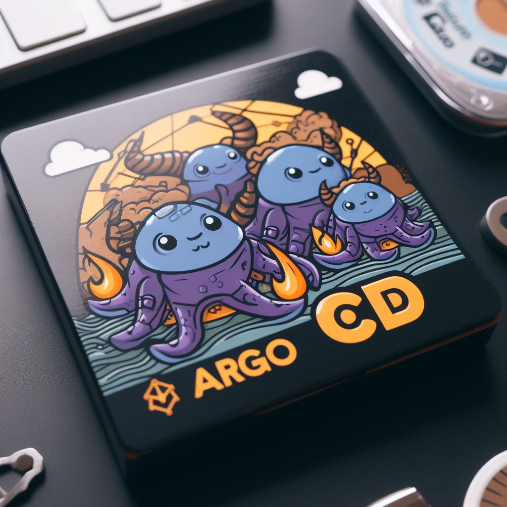
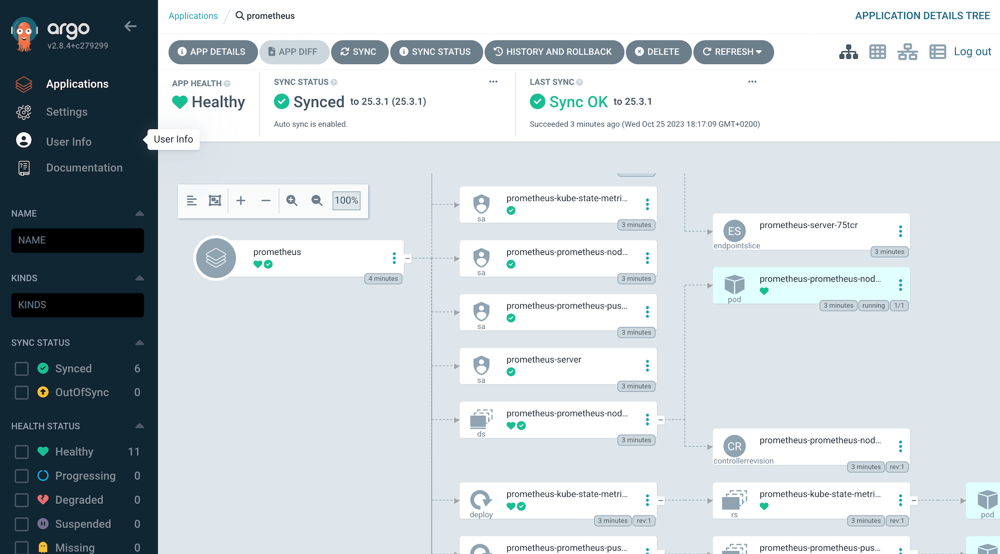
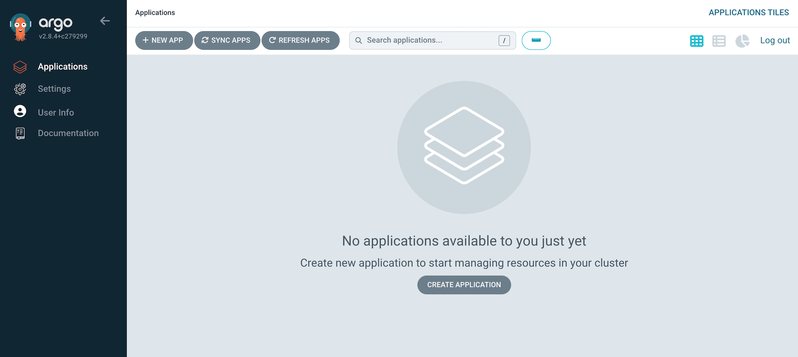
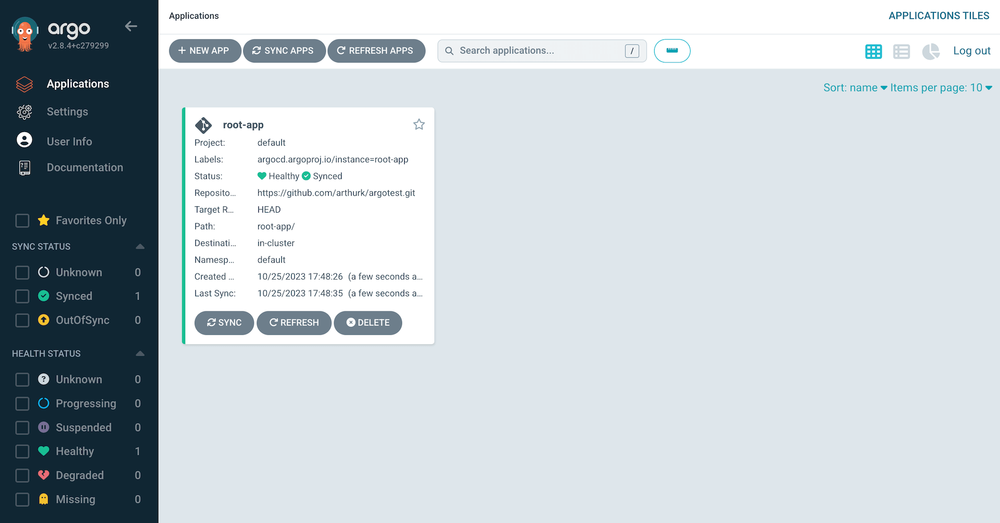
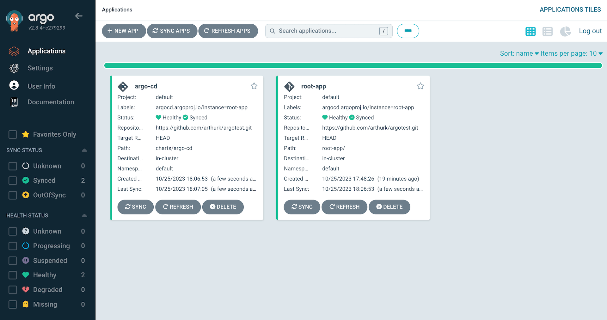
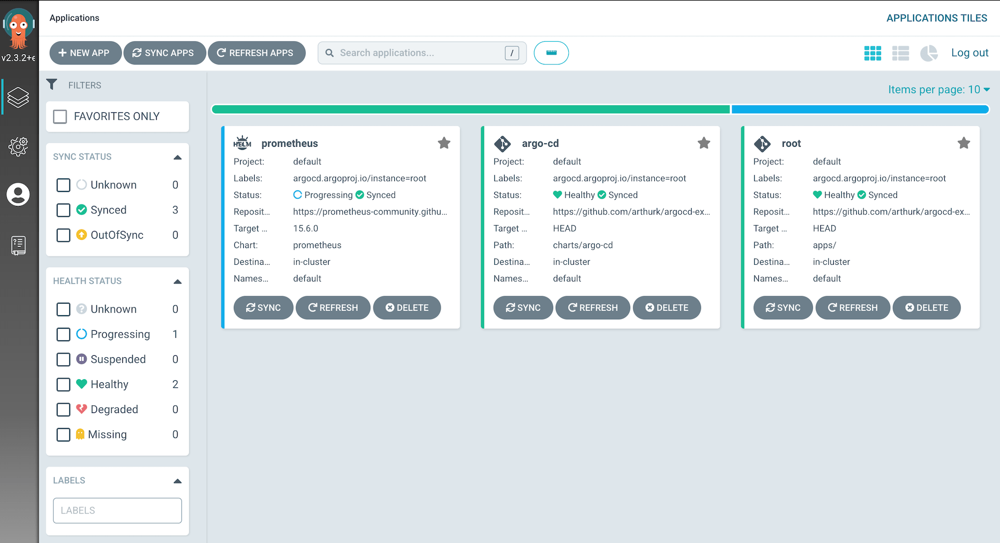

+++
title = "Setting up Argo CD with Helm"
date = "2021-01-05"
updated = "2023-10-27"
+++



In this blog post we're going to setup [Argo CD](https://argo-cd.readthedocs.io/en/stable/) on a Kubernetes cluster. We'll install it with Helm, create an application to use the [app-of-apps](https://argoproj.github.io/argo-cd/operator-manual/declarative-setup/#app-of-apps) pattern, set Argo CD up so that it can update itself, and install Prometheus via Argo CD as an example.



All files mentioned in this blog post are available in a [Git repository on GitHub](https://github.com/arthurk/argocd-example-install/).

## What is Argo CD?

[Argo CD](https://argoproj.github.io/argo-cd/) is a [GitOps](https://www.gitops.tech/) tool to automatically synchronize the cluster to the desired state defined in a Git repository. Each workload is defined declarative through a resource manifest in a YAML file. Argo CD checks if the state defined in the Git repository matches what is running on the cluster, and synchronizes it if changes were detected.

For example, instead of manually running CLI commands to update Kubernetes resources with `kubectl apply` or `helm upgrade`, we update a YAML files that we then commit and push to our Git repository. Each workload is described in an `Application` manifest. Argo CD periodically checks resources that are defined in the manifest for changes, and will automatically synchronize them with the ones that are running on our cluster.

A connection to the cluster, either from the developer's laptop or from a CI/CD system, is no longer needed because changes are now pulled from the Git repository by a Kubernetes operator that's running inside the cluster.

## Requirements

To follow this tutorial, you'll need the following:

- A Kubernetes cluster (1.28)
- kubectl (1.28)
- Helm (3.13)
- A public git repository (for Argo CD to pull the manifests)

Our application manifests will be stored in a public Git repository. For this tutorial I'm using GitHub, but this can be any public Git repository, and GitLab, Gitea, etc. work just as well.

## Creating a custom Helm chart

We'll use Helm to install Argo CD with the community-maintained chart from [argoproj/argo-helm](https://github.com/argoproj/argo-helm/tree/main/charts/argo-cd). The Argo project doesn't provide an official Helm chart.

Specifically, we are going to create a Helm "umbrella chart". This is basically a custom chart that wraps another chart. It pulls the original chart in as a dependency, and overrides the default values. In our case, we create an `argo-cd` Helm chart that wraps the community-maintained `argo-cd` Helm chart.

Using this approach, we have more flexibility in the future, by possibly including additional Kubernetes resources. The most common use case for this is to add Secrets (which could be encrypted using sops or SealedSecrets) to our application. For example, if we use webhooks with Argo CD, we have the possibility to securely store the webhook URL in a Secret.

To create the umbrella chart, we make a directory in our Git repository:

```
$ mkdir -p charts/argo-cd
```

Then place a `Chart.yaml` file in it:

[charts/argo-cd/Chart.yaml](https://github.com/arthurk/argocd-example-install/blob/master/charts/argo-cd/Chart.yaml)

```yaml
apiVersion: v2
name: argo-cd
version: 1.0.0
dependencies:
  - name: argo-cd
    version: 5.46.8
    repository: https://argoproj.github.io/argo-helm
```

The version of *our* custom chart doesn't matter and can stay the same. The version of the dependency matters and if you want to upgrade the chart, would be the place to do it. The important thing is that we pull in the community-maintained argo-cd chart as a dependency. Next, create a values.yaml file for our chart:

[charts/argo-cd/values.yaml](https://github.com/arthurk/argocd-example-install/blob/master/charts/argo-cd/values.yaml)

```yaml
argo-cd:
  dex:
    enabled: false
  notifications:
    enabled: false
  applicationSet:
    enabled: false
  server:
    extraArgs:
      - --insecure
```

To override the chart values of a dependency, we have to place them under the dependency name. Since our dependency in the Chart.yaml is called `argo-cd`, we have to place our values under the `argo-cd:` key. If the dependency name would be `abcd`, we'd place the values under the `abcd:` key.

All available options for the Argo CD Helm chart can be found in the [values.yaml](https://github.com/argoproj/argo-helm/blob/main/charts/argo-cd/values.yaml) file. 

We use a rather minimal installation, and disable components that are not useful for this tutorial. The changes are:

- Disable the dex component (integration with external auth providers).
- Disable the notifications controller (notify users about changes to application state).
- Disable the ApplicationSet controller (automated generation of Argo CD Applications).
- We start the server with the `--insecure` flag to serve the Web UI over HTTP. For this tutorial, we're using a local k8s server without TLS setup.

Before we install our chart, we need to generate a Helm chart lock file for it. When installing a Helm chart, Argo CD checks the lock file for any dependencies and downloads them. Not having the lock file will result in an error.

```
$ helm repo add argo-cd https://argoproj.github.io/argo-helm
$ helm dep update charts/argo-cd/
```

This will create the `Chart.lock` and `charts/argo-cd-<version>.tgz` files. The .tgz file is only required for the initial installation from our local machine. To avoid accidentally committing it, we can add it to the gitignore file:

```
$ echo "charts/**/charts" >> .gitignore
```

Our custom chart is ready and can be pushed to our public Git repository:

```
$ git add charts/argo-cd
$ git commit -m 'add argo-cd chart'
$ git push
```

The next step is to install our chart.

## Installing our Helm chart

We have to do the initial installation manually from our local machine, later we set up Argo CD to manage itself (meaning that Argo CD will automatically detect any changes to the helm chart and synchronize it):

```
$ helm install argo-cd charts/argo-cd/
```

After a minute all resources should have been deployed:

```
$ kubectl get pods
NAME                                         READY   STATUS    RESTARTS   AGE
argo-cd-argocd-redis-65ff569495-xtc86        1/1     Running   0          10s
argo-cd-argocd-repo-server-7c487bb9c-bl77h   1/1     Running   0          10s
argo-cd-argocd-server-6fd79f8fb5-54z9j       1/1     Running   0          10s
argo-cd-argocd-application-controller-0      1/1     Running   0          10s
```

## Accessing the Web UI

The Helm chart doesn't install an Ingress by default. To access the Web UI we have to port-forward to the `argocd-server` service on port 443:

```
$ kubectl port-forward svc/argo-cd-argocd-server 8080:443
```

We can then visit [http://localhost:8080](http://localhost:8080) to access it, which will show as a login form. The default username is **`admin`**. The password is auto-generated, we can get it with:

```
$ kubectl get secret argocd-initial-admin-secret -o jsonpath="{.data.password}" | base64 -d
```

Note that some shells (like Zsh) display a percentage sign at the end. It's not part of the password.

After logging in, we'll see the empty Web UI:



At this point, Argo CD applications could be added through the Web UI or CLI, but we want to manage everything in a declarative way (Infrastructure as code). This means need to write `Application` manifests in YAML, and commit them to our Git repo.

## Applications and root-app

In general, when we want to add an application to Argo CD, we need to add an [`Application`](https://argo-cd.readthedocs.io/en/stable/operator-manual/declarative-setup/#applications) resource in our Kubernetes cluster. The resource needs to specify where to find manifests for our application. These manifest can either be YAML files, a Helm chart, Kustomize or Jsonnet. In this tutorial, we'll focus on creating applications that use Helm charts.

For example, if we wanted to deploy [Prometheus](https://prometheus.io/) (which we will do later), we would write a `Application` YAML manifest for it, and put it in our Git repository. It would specify the URL to the Prometheus Helm-Chart, and override values to customize it. We would then apply the manifest and wait for the resources to be created in the cluster.

The easiest way to apply the manifest is with the kubectl CLI. However, it's a manual step that's error-prone, insecure, and we need to repeat it every time we add or update applications. With Argo CD there is a better way to handle this. We can automate adding/updating applications by creating an Application that implements the [app of apps](https://argo-cd.readthedocs.io/en/stable/operator-manual/declarative-setup/#app-of-apps) pattern. In this tutorial, we'll call this the **"root-app"**.

The root-app is a Helm chart that renders Application manifests. Initially it has to be added manually, but after that we can just commit Application manifests with Git, and they will be deployed automatically.

To show how this works in more detail, we'll create the root-app next.

## Creating the root-app Helm chart

The root-app will be a Helm chart. You could also use Kubernetes YAML manifests, but after adding more applications there will be a lot of duplicated code (like the destination cluster), and we can reduce it by putting the values in the charts values file. Another interesting solution for this are [ApplicationSets](https://argo-cd.readthedocs.io/en/stable/user-guide/application-set/), but we won't cover them in this tutorial.

We create the chart in the same public Git repository from before. We put a `Chart.yaml` file and an (empty) `values.yaml` file in it:

```
$ mkdir -p charts/root-app/templates
$ touch charts/root-app/values.yaml
```

[charts/root-app/Chart.yaml](https://github.com/arthurk/argocd-example-install/blob/master/charts/root-app/Chart.yaml)

```yaml
apiVersion: v2
name: root-app
version: 1.0.0
```

We create the `Application` manifest for our root-app in `charts/root-app/templates/root-app.yaml`. Make sure to replace the `repoURL` with the one for your public Git repo:

[charts/root-app/templates/root-app.yaml](https://github.com/arthurk/argocd-example-install/blob/master/charts/root-app/templates/root-app.yaml):

```yaml
apiVersion: argoproj.io/v1alpha1
kind: Application
metadata:
  name: root-app
  finalizers:
  - resources-finalizer.argocd.argoproj.io
spec:
  project: default
  source:
    repoURL: https://github.com/arthurk/argocd-example-install.git
    path: charts/root-app/
    targetRevision: HEAD
  destination:
    server: https://kubernetes.default.svc
    namespace: default
  syncPolicy:
    automated:
      selfHeal: true
```

The above `Application` watches our root-app Helm chart (under `charts/root-app/`), and if changes were detected, synchronizes (meaning that it will render the Helm chart and apply the resulting manifests on the cluster) it. 

How does Argo CD know our application is a Helm chart? It looks for a `Chart.yaml` file under `path` in the Git repository. The same applies for Kustomize, which will be used if it finds a `kustomization.yaml` in a directory.

Argo CD will not use `helm install` to install charts. It will render the chart with `helm template` and then apply the output with `kubectl`. This means we can't run `helm list` on a local machine to get all installed releases.

We push the files to our Git repository:

```
$ git add charts/root-app
$ git commit -m 'add root-app'
$ git push
```

And then apply the manifest in our Kubernetes cluster. The first time we have to do it manually, later we'll let Argo CD manage the root-app and synchronize it automatically:

```
$ helm template root-app/ | kubectl apply -f -
```

In the Web UI we can now see that the root-app was created:



## Let Argo CD manage itself

We previously installed Argo CD manually by running `helm install` from our local machine. This means that updates to Argo CD, like upgrading the chart version or changing the `values.yaml`, require us to execute the Helm CLI command from a local machine again. It's repetitive, error-prone and inconsistent with how we install other applications in our cluster.

The solution is to let Argo CD manage Argo CD. To be more specific: We let the Argo CD controller watch for changes to the argo-cd helm chart in our repo (under `charts/argo-cd`), render the Helm chart, and apply the resulting manifests. It's done using `kubectl` and asynchronous, so it is safe for Kubernetes to restart the Argo CD Pods after it has been executed.

To achieve this, we need to create an Application manifest that points to our Argo CD chart. We'll use the same chart version and values file as with our previous manual installation, so initially there won't be any changes made to the resources in the cluster.

The application manifest looks like this:

[charts/root-app/templates/argo-cd.yaml](https://github.com/arthurk/argocd-example-install/blob/master/charts/root-app/templates/argo-cd.yaml):

```yaml
apiVersion: argoproj.io/v1alpha1
kind: Application
metadata:
  name: argo-cd
  finalizers:
  - resources-finalizer.argocd.argoproj.io
spec:
  project: default
  source:
    repoURL: https://github.com/arthurk/argocd-example-install.git
    path: charts/argo-cd
    targetRevision: HEAD
  destination:
    server: https://kubernetes.default.svc
    namespace: default
  syncPolicy:
    automated:
      selfHeal: true
```

We can commit and push the application manifest to our Git repository. We don't need to generate a Chart.lock file since we don't have any dependencies:

```
$ git add charts/root-app/templates/argo-cd.yaml
$ git commit -m 'add argo-cd application'
$ git push
```

In the Web UI we should now see the root-app being `OutOfSync`, and then changing to `Syncing`. If it doesn't show the changes right away, it's probably due to the default change detection polling rate of 3 minutes. We can speed this up by clicking on the *Refresh* button on the root-app which triggers a manual sync.

For faster change detection look into setting up [webhooks](https://argo-cd.readthedocs.io/en/stable/operator-manual/webhook/), these will trigger a sync immediately after pushing to the Git repo.



Once the Argo CD application is green (synced) we're done. We can make changes to our Argo CD installation the same way we change other applications: by changing the files in the repo and pushing it to our Git repository.

The final directory structure should look like this:

```
└── charts
    ├── argo-cd
    │   ├── Chart.lock
    │   ├── Chart.yaml
    │   └── values.yaml
    └── root-app
        ├── Chart.yaml
        ├── templates
        │   ├── argo-cd.yaml
        │   └── root-app.yaml
        └── values.yaml
```

As a last step, we can remove the Secret that Helm creates for each manual chart installation:

```
$ kubectl delete secret -l owner=helm,name=argo-cd
```

## Example: Installing Prometheus

As a real-world example on how to deploy a Helm chart with Argo CD, we'll add [Prometheus](https://prometheus.io/) to our cluster.

First we create an `Application` manifest in `charts/root-app/templates/prometheus.yaml` that uses the [Prometheus helm chart](https://github.com/prometheus-community/helm-charts/tree/main/charts/prometheus).

[charts/root-app/templates/prometheus.yaml](https://github.com/arthurk/argocd-example-install/blob/master/charts/root-app/templates/prometheus.yaml)

```yaml
apiVersion: argoproj.io/v1alpha1
kind: Application
metadata:
  name: prometheus
  finalizers:
  - resources-finalizer.argocd.argoproj.io
spec:
  project: default
  source:
    repoURL: https://prometheus-community.github.io/helm-charts
    chart: prometheus
    targetRevision: 25.3.1
    helm:
      values: |
        pushgateway:
          enabled: false
  destination:
    server: https://kubernetes.default.svc
    namespace: default
  syncPolicy:
    automated:
      prune: true
      selfHeal: true
```

There are a few differences compared to our previously created Argo CD Application:

- The `repoURL` is set to the [prometheus-community](https://github.com/prometheus-community/helm-charts/) Helm chart repository.
- We're using `chart` (instead of `path`) to specify the Helm chart we want to use (the repository contains multiple Helm charts).
- The `targetRevision` is set to the chart version.
- We're overriding the chart default [values](https://github.com/prometheus-community/helm-charts/blob/main/charts/prometheus/values.yaml) inline, rather than keeping them in a separate values.yaml file.
- We've added `prune` sync policy. This will delete all Kubernetes resources when the Application is deleted. Previously, we didn't set this as a pre-caution. If we had it enabled and accidentally deleted the root-app or argo-cd app, it would delete all applications in the cluster.

To deploy the application, we just need to commit and push the manifest to our Git repository:

```
$ git add charts/root-app/templates/prometheus.yaml
$ git commit -m 'add prometheus'
$ git push
```

After the next refresh, Prometheus should show up in the Web UI: 



Clicking on the application will show us a detailed overview of all resources in the Prometheus helm chart:


## Example: Uninstall Prometheus

To uninstall Prometheus, we just have to delete the previously added `prometheus.yaml` file from out Git repo:

```
$ git rm charts/root-app/templates/prometheus.yaml
$ git commit -m 'remove prometheus'
$ git push
```

The application, along with all its resources, will then be removed from the cluster. 

## Conclusion

In this tutorial, we've installed Argo CD with Helm, and set it up so that it can manage itself. This allows us to update Argo CD the same way we update other applications: by modifying the manifest inside the Git repository.

We've created a root application that uses the [app-of-apps](https://argo-cd.readthedocs.io/en/stable/operator-manual/declarative-setup/#app-of-apps) pattern to manage our applications in a declarative way.

Applications can be added, updated or removed using Git commits. As an example, we've installed and uninstalled Prometheus in our cluster.

All files mentioned in this blog post are available in a [Git repository on GitHub](https://github.com/arthurk/argocd-example-install/).
