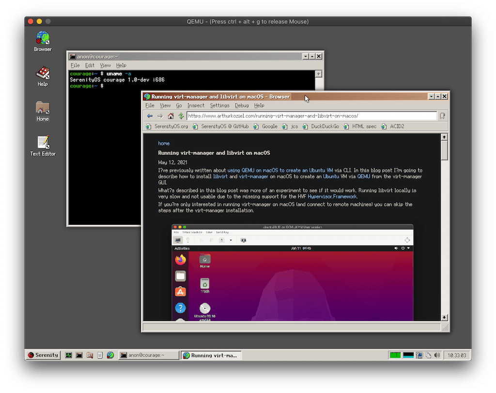

+++
title = "Running SerenityOS on macOS"
+++

In this blog post, I'll describe how to build and run [SerenityOS](https://serenityos.org/) on macOS (via QEMU).

SerenityOS is an operating system that combines UNIX with the GUI of Windows 9x/NT. It's still early in development but being improved daily with many contributors working on it.



The tips mentioned here can also be found in the [wiki](https://github.com/SerenityOS/serenity/blob/master/Documentation/BuildInstructions.md). This tutorial is a step-by-step guide specifically for macOS. It will work on Catalina but to run this on macOS Big Sur you'll need to grant QEMU the permission to use the macOS hypervisor via entitlements. See my [previous blog post](https://www.arthurkoziel.com/qemu-on-macos-big-sur/) about how to do this.

## Installing Xcode

We need to have a full [Xcode](https://developer.apple.com/xcode/) installation on our system to compile SerenityOS. The Command Line Tools are not enough.

Xcode can be downloaded from the [Apple Developer page](https://developer.apple.com/download/more/
). To access it you'll need an iCloud account and accept the Developer Agreement that will show up when opening the link.

Note that Xcode 12.4 is the last version compatible with macOS Catalina.

After the download is done, move the app to your `Applications`.

If you previously had the Command Line Tools installed, you'll need to change the
active developer directory and point it to the new Xcode installation:

```
sudo xcode-select -s /Applications/Xcode.app/Contents/Developer
```

## Installing Dependencies

Most dependencies can be installed via Homebrew. The only exception is [fuse-ext2](https://github.com/alperakcan/fuse-ext2), which doesn't have a Homebrew Formula and has to installed manually. 

First we install the dependencies from Homebrew:

```
brew install coreutils qemu bash gcc@10 ninja cmake macfuse
```

Once the installation is done, you'll need to reboot your machine for macfuse to work.

After the reboot we need to install fuse-ext2. The SerenityOS developers provide a bash
script in the git repository:

```
git clone https://github.com/SerenityOS/serenity.git
cd serenity/Toolchain
./BuildFuseExt2.sh
```

## Building SerenityOS

Now that we have all dependencies installed, we need to compile the SerenityOS
toolchain. The toolchain includes a GCC cross-compiler that is needed to compile SerenityOS itself:

```
./BuildIt.sh
```

As the "gcc" that is shipped with Xcode is just an alias for `clang` we need to change the binary that is used by CMake:

```
cd ../Build/i686
rm -rf Root/
cmake ../.. -G Ninja -DCMAKE_C_COMPILER=gcc-10 -DCMAKE_CXX_COMPILER=g++-10
```

Finally, we can compile SerenityOS, build a disk image and run it:

```
ninja install
ninja image
ninja run
```

The QEMU window will show up and boot right into the SerenityOS desktop where we
can play around with it.
