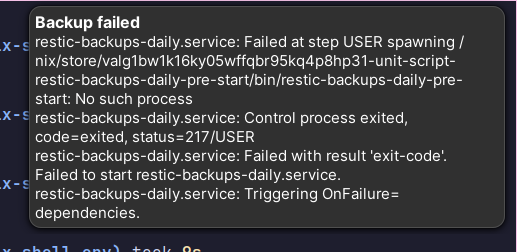

+++
title = "Restic Backups on Backblaze B2 with NixOS"
+++

In this post I'll show how I setup [restic](https://restic.net/) backups on my desktop computer that is running [NixOS](https://nixos.org/). I'll go though the steps on how to create a [B2](https://www.backblaze.com/cloud-storage) bucket, the NixOS configuration including secret storage with [age](https://github.com/FiloSottile/age) via [agenix](https://github.com/ryantm/agenix), and desktop notifications in case there are errors.


We start by creating a bucket on B2 where the encrypted restic backups will be stored.

## Creating the B2 bucket

To create a bucket named `restic-blog-test-bucket` we run the following command:

```
$ backblaze-b2 create_bucket restic-blog-test-bucket allPrivate \
  --defaultServerSideEncryption=SSE-B2 \
  --lifecycleRules='[{"daysFromHidingToDeleting": 30, "daysFromUploadingToHiding": null, "fileNamePrefix": ""}]'
```

Bucket names are globally unique, meaning that they must have a unique name across all B2 buckets (not just in the account). The important thing is to set the visibility to private (`allPrivate`). Enabling Server-Side Encryption (SSE) is not strictly necessary given that restic already encrypts the data.

We also add a lifecycle-rule to delete old versions of files (files that have been overwritten) after 30 days. This saves storage space. By default a B2 bucket retains old versions of a file indefinitely. For us this feature is unnecessary since restic will automatically manage file versions (revisions) and regularly prune old ones.

Next we create an application key so that we can programatically access the B2 API from within the systemd service later on:

```
$ backblaze-b2 create-key --bucket restic-blog-test-bucket blog-test-key "deleteFiles, listAllBucketNames, listBuckets, listFiles, readBucketEncryption, readBucketReplications, readBuckets, readFiles, shareFiles, writeBucketEncryption, writeBucketReplications, writeFiles"
```

The permissions allow restic to do any operation within the bucket. The `listAllBucketNames` allows to list all bucket names in the account. It is also necessary and without it the backup will break.

The command will output two values which we need to save. The first value is the application key *ID* and the second value is the application key itself. Both are sensitive values that we need to store in an encrypted format.

## Setup agenix

For restic to be able to access the B2 bucket from within the systemd service, we need to store the credentials. We store the credentials in files and use [age](https://github.com/FiloSottile/age) to encrypt them.

[Agenix](https://github.com/ryantm/agenix) makes it easy to use age-encrypted secrets in NixOS. Installation via flakes can be done by adding the input and importing the module:

```nix
{
  inputs.agenix.url = "github:ryantm/agenix";

  outputs = { self, nixpkgs, agenix }: {
    nixosConfigurations.yourhostname = nixpkgs.lib.nixosSystem {
      # ...
      modules = [
        # ...
        agenix.nixosModules.default
      ];
    };
  };
}
```

To create a secret we need to use the `agenix` CLI. By default, the program looks for a file called `secrets.nix` that specifies the SSH public keys to use for each encrypted file.

```
$ mkdir -p secrets/restic
$ cd secrets/
$ touch secrets.nix
```

For our setup we need to store 3 secrets: The repository name, password and specific environment variables that are required by the restic B2 integration. We are using the same SSH public key for all files:

```nix
let
  arthur = "ssh-ed25519 AAAAC3NzaC1lZD...t07oaewMGVuqmcb";
in
{
  "restic/env.age".publicKeys = [ arthur ];
  "restic/repo.age".publicKeys = [ arthur ];
  "restic/password.age".publicKeys = [ arthur ];
}
```

### Password secret file

First we create the repository password file:

```
$ nix run github:ryantm/agenix -- -e restic/password.age
```

The password will be used by restic to encrypt and decrypt the files in the repository. Since our repository doesn't exist yet, we can generate a new password and store it in the file.

### Environment Secret file

Second we create the environment file:

```
$ nix run github:ryantm/agenix -- -e restic/env.age
```

When running the backup job the restic systemd service will read environment variables from this file. For the restic B2 integration we have to specify the `B2_ACCOUNT_KEY` and `B2_ACCOUNT_ID` environment variables. The values are the output of the `create-key` command from before. The file content should be in this format:

```sh
B2_ACCOUNT_ID="my-id"
B2_ACCOUNT_KEY="my-key"
```

### Repository secret file

Lastly we specify the repository name in the repo file:

```
$ nix run github:ryantm/agenix -- -e restic/repo.age
```

This is the name of the B2 bucket that we created with the `create_bucket` command before. The name has to be prefixed with `b2:`:

```
b2:my-bucket-name
```

### Decrypting files

You might run into the following issue when trying to decrypt the age files (for example for editing them):

```
Error: Unsupported SSH key: /home/arthur/.ssh/id_rsa
```

This happens if you didn't specify your SSH keys in `config.services.openssh.hostKeys`. If you're not running an OpenSSH server on your machine, this is probably not set, in which case agenix defaults to using the `id_rsa` key. For example I used my `id_ed25519` key.

The fix is to pass the key via the `-i` (identity path) argument:

```
nix run github:ryantm/agenix -- -e restic/env.age -i ~/.ssh/id_ed25519
```

We also need to specify the identity path in the NixOS configuration in the next step.

## Create the NixOS config

In our `configuration.nix` file we import `restic.nix` (it can also be put into the same file if preferred) and set the identity paths for agenix:

```nix
{
  imports = [
    ./hardware-configuration.nix
    # ...
    ./restic.nix
  ];

  age.identityPaths = [ "${config.users.users.arthur.home}/.ssh/id_ed25519" ];
}
```

In our NixOS config directory we create a new file called `restic.nix` with the following content:

```nix
{
  # configure agenix secrets
  age.secrets = {
    "restic/env".file = ../secrets/restic/env.age;
    "restic/repo".file = ../secrets/restic/repo.age;
    "restic/password".file = ../secrets/restic/password.age;
  };

  # configure restic backup services
  services.restic.backups = {
    daily = {
      initialize = true;

      environmentFile = config.age.secrets."restic/env".path;
      repositoryFile = config.age.secrets."restic/repo".path;
      passwordFile = config.age.secrets."restic/password".path;

      paths = [
        "${config.users.users.arthur.home}/documents"
      ];

      pruneOpts = [
        "--keep-daily 7"
        "--keep-weekly 5"
        "--keep-monthly 12"
      ];
    };
  };
}
```

The secrets specify the path to our encrypted age files that we created before.

The [backup service](https://github.com/NixOS/nixpkgs/blob/nixos-23.05/nixos/modules/services/backup/restic.nix) has the name `daily` (can be changed to any other name if preferred), which will create a systemd service called `restic-backups-daily.service`.

The default systemd timer config runs the job at midnight each day. It also enables the [Persistent](https://www.freedesktop.org/software/systemd/man/latest/systemd.timer.html#Persistent=) option by default, meaning that if the computer was off during the trigger time, it will run the job immediatelly after the machine starts up again.

The prune option will remove old data that is not needed anymore. This is used to save space. The NixOS service will run the `restic forget --prune` command. In the example above we want to keep the most recent 7 daily, 5 weekly and 12 monthly snapshots. If left out, each daily backup will be kept forever.

Add the files to git, rebuild your system and switch to the new configuration:

```
$ git add secrets/ restic.nix
$ nixos-rebuild --flake .#mycomputer switch
```

This should create the restic backup systemd services (but not trigger them yet).

### Systemd Service

The systemd service that will run the backups each day looks like this:

```
$ systemctl status restic-backups-daily.service
○ restic-backups-daily.service
     Loaded: loaded (/etc/systemd/system/restic-backups-daily.service; linked; preset: enabled)
     Active: inactive (dead) since Wed 2023-11-22 14:40:38 CET; 3h 5min ago
TriggeredBy: ● restic-backups-daily.timer
```

We can see that the service is triggered by `restic-backups-daily.timer`, which looks like this:

```
$ systemctl status restic-backups-daily.timer
● restic-backups-daily.timer
     Loaded: loaded (/etc/systemd/system/restic-backups-daily.timer; enabled; preset: enabled)
     Active: active (waiting) since Wed 2023-11-22 13:52:14 CET; 3h 53min ago
    Trigger: Thu 2023-11-23 00:00:00 CET; 6h left
   Triggers: ● restic-backups-daily.service
```

To test if backups are working we start the service manually:

```
$ sudo systemctl start restic-backups-daily.service
```

To check the output we run:

```
$ journalctl -u restic-backups-daily.service
systemd[1]: Starting restic-backups-daily.service...
restic-backups-daily-pre-start[53021]: Fatal: unable to open config file: Stat: b2_download_file_by_name: 404:
restic-backups-daily-pre-start[53021]: Is there a repository at the following location?
restic-backups-daily-pre-start[53021]: b2:my-bucket
restic-backups-daily-pre-start[53038]: created restic repository c66237620d at
restic-backups-daily-pre-start[53038]: Please note that knowledge of your password is required to access
restic-backups-daily-pre-start[53038]: the repository. Losing your password means that your data is
restic-backups-daily-pre-start[53038]: irrecoverably lost.
restic[53054]: no parent snapshot found, will read all files
restic[53054]: Files:         846 new,     0 changed,     0 unmodified
restic[53054]: Dirs:          107 new,     0 changed,     0 unmodified
restic[53054]: Added to the repository: 244.128 MiB (212.474 MiB stored)
restic[53054]: processed 846 files, 314.304 MiB in 0:16
restic[53054]: snapshot d409fc8f saved
restic[53079]: Applying Policy: keep 7 daily, 5 weekly, 12 monthly snapshots
restic[53079]: keep 1 snapshots:
restic[53079]: ID        Time                 Host        Tags        Reasons           Paths
restic[53079]: -----------------------------------------------------------------------------------------------
restic[53079]: d409fc8f  2023-11-22 14:09:36  mycomputer              daily snapshot    /home/arthur/documents
restic[53079]:                                                        weekly snapshot
restic[53079]:                                                        monthly snapshot
restic[53079]: -----------------------------------------------------------------------------------------------
restic[53079]: 1 snapshots
restic[53096]: using temporary cache in /var/cache/restic-backups-daily/restic-check-cache-1922151602
restic[53096]: create exclusive lock for repository
restic[53096]: load indexes
restic[53096]: check all packs
restic[53096]: check snapshots, trees and blobs
restic[53096]: [0:01] 100.00%  1 / 1 snapshots
restic[53096]: no errors were found
systemd[1]: restic-backups-daily.service: Deactivated successfully.
systemd[1]: Finished restic-backups-daily.service.
systemd[1]: restic-backups-daily.service: Consumed 8.131s CPU time, received 1.6M IP traffic, sent 213.2M IP traffic.
```

The backup finished successfully. Since this is the first run and the restic repository didn't exist before, there was an error at the beginning which can be ignored. The next run should not have this error since the repository has been initialized now.

## Testing Backup Restore

To test that we can restore backups we have to use the restic CLI. We can run a nix shell with the restic package:

```
$ nix-shell -p restic
```

To access B2 from restic we need to set two environment variables that have the account key ID and the account key itself. Thes eare the same ones we saved in `secrets/restic/env.age`):

```
$ export B2_ACCOUNT_ID="my-id"
$ export B2_ACCOUNT_KEY="my-key"
```

Now we can list our snapshots. Since we've manually run the backup job before, it should show that we have one snapshot:

```
$ restic -r b2:my-bucket-name snapshots
enter password for repository:
repository c6622116 opened (version 2, compression level auto)
ID        Time                 Host        Tags        Paths
-----------------------------------------------------------------------------
47a123a4  2023-11-22 14:40:11  desktop                 /home/arthur/documents
-----------------------------------------------------------------------------
```

To restore it into the `restore-backup` directory we run:

```
$ restic -r b2:my-bucket-name restore --target restore-backup latest
```

The restored files should now be available.

## Desktop notifications for failures

To notify us in case the backup fails we can setup desktop notifications. This also works when the backup is started (and fails) before the window manager launched. The notification will be shown on the next start.

Basically we create a systemd service that runs the `notify-send` command in a shell script, and attach it to the [`OnFailure`](https://www.freedesktop.org/software/systemd/man/latest/systemd.unit.html#OnFailure=) event of the restic backup service.

We put the following code into the same `restic.nix` file as above:

```nix
{
  environment.systemPackages = [
    pkgs.libnotify
  ];

  systemd.services.restic-backups-daily.unitConfig.OnFailure = "notify-backup-failed.service";

  systemd.services."notify-backup-failed" = {
    enable = true;
    description = "Notify on failed backup";
    serviceConfig = {
      Type = "oneshot";
      User = config.users.users.arthur.name;
    };

    # required for notify-send
    environment.DBUS_SESSION_BUS_ADDRESS = "unix:path=/run/user/${
            toString config.users.users.arthur.uid
          }/bus";

    script = ''
      ${pkgs.libnotify}/bin/notify-send --urgency=critical \
        "Backup failed" \
        "$(journalctl -u restic-backups-daily -n 5 -o cat)"
    '';
  };
}
```

To try it out we set the user of the restic backup service to a non-existing one:

```nix
{
  services.restic.backups = {
    daily = {
      # ...
      user = "doesntexist";
    };
  };
}
```

Now we manyally trigger a backup:

```
$ sudo systemctl start restic-backups-daily.service
Job for restic-backups-daily.service failed because the control process exited with error code.
```

This will show a desktop notification:



With this working the automated backups are done. They will run every day at midnight or on the next boot if the machine was off. In case the backup fails we will get a notification and can then use the systemd logs to further investigate and fix the issue.
