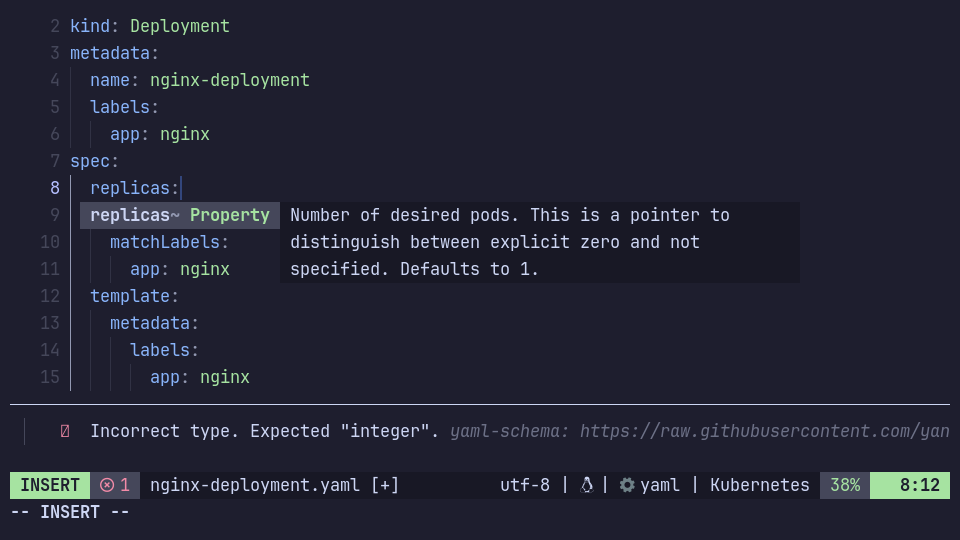
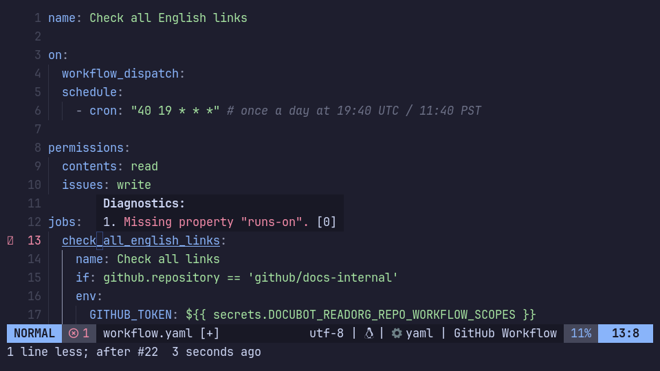
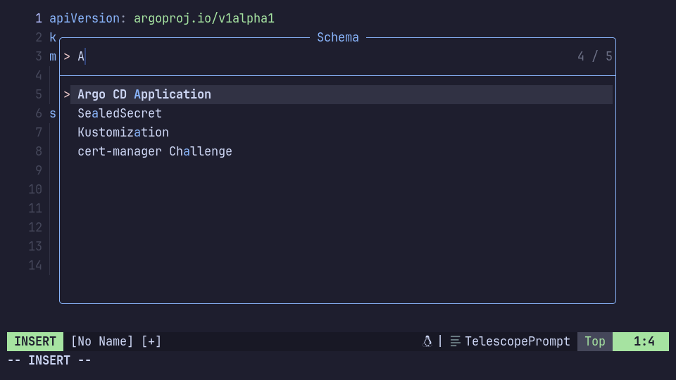
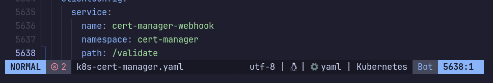
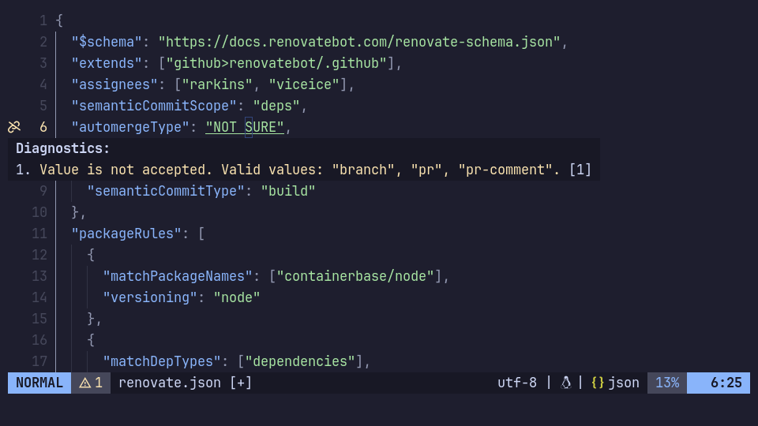
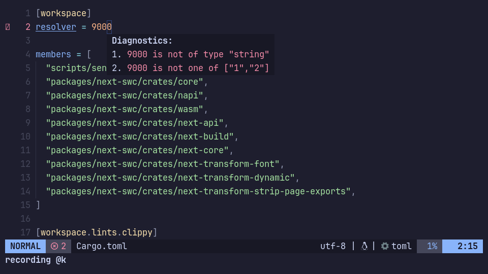

+++
title = "JSON Schemas in Neovim"
+++

In this post I'll describe how to setup JSON schemas in Neovim.



Basically, a [JSON Schema](https://json-schema.org/) describes the structure of data in a document. Most commonly these are YAML, JSON and sometimes TOML documents. For example we can make sure our GitHub Actions Workflow YAML file is valid (has all required fields, etc.) while writing it in our editor.

Most schemas can be found in the [JSON Schema Store](https://www.schemastore.org/json/). Since YAML/JSON/TOML are the most common formats in the [catalog](https://www.schemastore.org/api/json/catalog.json), I'll show how to use those in this blog post. However I'll mostly focus on YAML files since that's what I'm using the most.

In the following sections I'll go through each file format and show how to setup the LSP client config using [neovim/nvim-lspconfig](https://github.com/neovim/nvim-lspconfig).

## YAML



There are (at least) 3 plugins which are related to JSON schemas for YAML files:

- [yaml-language-server](https://github.com/redhat-developer/yaml-language-server)
- [b0o/SchemaStore.nvim](https://github.com/b0o/SchemaStore.nvim)
- [someone-stole-my-name/yaml-companion.nvim](https://github.com/someone-stole-my-name/yaml-companion.nvim)

In the following sections I'll describe them and show example configurations.

### yaml-language-server

For LSP-support, we most likely have the [yaml-language-server](https://github.com/redhat-developer/yaml-language-server) installed. Support for JSON schemas, and fetching them from the schema store, is built-in and enabled by default.

Every time the language-server is started, it will fetch the [catalog](https://www.schemastore.org/api/json/catalog.json) (around 300kb) and try to match a schema by filename. Each entry in the catalog, has a `fileMatch` property that will be checked. For example for a file named `kustomization.yaml` it will load the JSON Schema for [kustomize files](https://json.schemastore.org/kustomization.json) since it matches the pattern `["kustomization.yaml", "kustomization.yml"]`.

In my experience, using the default settings with the whole schema store catalog is not a good idea, as some of the entries have very generic filenames. For example a `template.yaml` file will load the schema for `AWS CloudFormation Serverless Application Model`, for a YAML file inside a `test_data/` directory it will load the `Drupal info file` schema, and for a `plugin.yml` file a `PocketMine plugin manifest file`.

This will often lead to situations where we have a file with a name like `template.yaml` that has nothing to do with AWS SAM and our editor will be full of errors. To avoid this, it's best to only use a subset of the catalog. The following example disables the schema store support and only uses 3 schemas:

```lua
require('lspconfig').yamlls.setup {
  settings = {
    yaml = {
      validate = true,
      -- disable the schema store
      schemaStore = {
        enable = false,
        url = "",
      },
      -- manually select schemas
      schemas = {
        ['https://json.schemastore.org/kustomization.json'] = 'kustomization.{yml,yaml}',
        ['https://raw.githubusercontent.com/docker/compose/master/compose/config/compose_spec.json'] = 'docker-compose*.{yml,yaml}'
        ["https://raw.githubusercontent.com/datreeio/CRDs-catalog/main/argoproj.io/application_v1alpha1.json"] = "argocd-application.yaml",
      }
    }
  }
}
```

Most of the values can be copied from the [catalog](https://www.schemastore.org/api/json/catalog.json), and additional schemas for Kubernetes can be found in [datreeio/CRDs-catalog](https://github.com/datreeio/CRDs-catalog). It takes more time to setup but the result is better than having to deal with errors because the wrong schema was loaded.

### SchemaStore.nvim

The [SchemaStore.nvim](https://github.com/b0o/SchemaStore.nvim) plugin was initially written for the json-language-server but support for the yaml-language-server has been added later on.

Compared to the yamlls built-in support it makes it easy to select, ignore or replace specific schemas from store catalog. The code example from above, which includes 2 schemas from the store catalog and adds one extra schema from outside of it, could be rewritten as:

```lua
require('lspconfig').yamlls.setup {
  settings = {
    yaml = {
      schemaStore = {
        enable = false,
        url = "",
      },
      schemas = require('schemastore').yaml.schemas {
        -- select subset from the JSON schema catalog
        select = {
          'kustomization.yaml',
          'docker-compose.yml'
        },

        -- additional schemas (not in the catalog)
        extra = {
          url = 'https://raw.githubusercontent.com/datreeio/CRDs-catalog/main/argoproj.io/application_v1alpha1.json',
          name = 'Argo CD Application',
          fileMatch = 'argocd-application.yaml'
        }
      }
    }
  }
}
```

Each item in the `select` attribute has to match the `name` attribute in the catalog. The file name pattern that will be matched can not be changed.

Choosing between the yamlls built-in schema store support and the SchemaStore.nvim is personal preferrence. Both work great.

### yaml-companion.nvim



The yaml-companion plugin is more like a "frontend" for JSON schemas. It comes with a Telescope picker that lets us manually choose the schema for the current buffer, enhances the auto-completion by showing descriptions and has good support for Kubernetes resources (see Kubernetes section below).

In the following example, we use the yamlls built-in schema store support to automatically load the GitHub Actions Workflows schema based on a filename pattern. Additionally, we add an extra schema for Flux GitRepository resources, which can be loaded manually by selecting it in the Telescope picker (`:Telescope yaml_schema`):

```lua
local cfg = require("yaml-companion").setup{
  -- Additional schemas available in Telescope picker
  schemas = {
    {
      name = "Flux GitRepository",
      uri = "https://raw.githubusercontent.com/fluxcd-community/flux2-schemas/main/gitrepository-source-v1.json",
    }
  },

  -- Pass any additional options that will be merged in the final LSP config
  -- Defaults: https://github.com/someone-stole-my-name/yaml-companion.nvim/blob/main/lua/yaml-companion/config.lua
  lspconfig = {
    settings = {
      yaml = {
        validate = true,
        schemaStore = {
          enable = false,
          url = "",
        },
        schemas = {
          ['https://json.schemastore.org/github-workflow.json'] = '.github/workflows/*.{yml,yaml}',
        }
      }
    }
  }
}

require("lspconfig")["yamlls"].setup(cfg)

-- :Telescope yaml_schema
require("telescope").load_extension("yaml_schema")
```

The plugin also makes it possible to get the active schema in the current buffer, which we can then use in [lualine](https://github.com/nvim-lualine/lualine.nvim). In the screenshot below we can see at the bottom-right that the "Kubernetes" schema is loaded.



The following config will show the active schema in lualine like in the screenshot:

```lua
local function get_schema()
  local schema = require("yaml-companion").get_buf_schema(0)
  if schema.result[1].name == "none" then
    return ""
  end
  return schema.result[1].name
end

require('lualine').setup {
  sections = {
    lualine_x = {'encoding', 'fileformat', 'filetype', get_schema},
  },
}
```

However, this only works if the schema is loaded either via Kubernetes auto-detect or if it's listed in the yaml-companion schemas setting, like Flux CD GitRepository in the example above. To automatically load a schema and have it show in the statusline, it needs to be added twice: to the `yaml-companion.schemas` and to the `lspconfig.settings.yaml.schemas`.

### Kubernetes

Kubernetes resources are not included in the JSON schema store and they cannot be matched by filename since there is no naming convention. To reliably detect them, we have to check the file content for `apiVersion` and `kind` attributes, and then load the correct schema based on the values.

Both the yaml-language-server and the yaml-companion plugin have support for Kubernetes, but they use a different approach.

In yamlls it has to be explicitly enabled by specifying a filename pattern:

```lua
lspconfig.yamlls.setup {
  settings = {
    yaml = {
      validate = true,
      schemas = {
        kubernetes = { 'k8s**.yaml', 'kube*/*.yaml' },
      }
    }
  }
}
```

The Kubernetes schemas are downloaded from [yannh/kubernetes-json-schema](https://github.com/yannh/kubernetes-json-schema). It's currently uses the schemas from Kubernetes v1.22.4. The Kubernetes version is hardcoded and needs to be updated manually by the developers.

Yaml-companion has a more advanced Kubernetes support by detecting schemas based on the file content. It checks if the YAML file has a `kind` attribute, and that the value matches a [pre-defined](https://github.com/someone-stole-my-name/yaml-companion.nvim/blob/main/lua/yaml-companion/builtin/kubernetes/resources.lua) resource name. Similar to yamlls the Kubernetes version is hardcoded to 1.22.4:

```lua
local cfg = require("yaml-companion").setup {
  builtin_matchers = {
    kubernetes = { enabled = true },
  }
  -- ...
}

require("lspconfig")["yamlls"].setup(cfg)
```

Since the list of resources is hardcoded, the auto-detection doesn't work for Custom Resources (CRDs). To load a CRD schema, we have two options:

- Manually load it by adding it to the `schemas` setting (see example further above with `Flux GitRepository`) and then selecting it from the Telescope picker (`:Telescope yaml_schema`).
- Add it to the yamlls schemas and define a matching filename pattern. The benefit of this is that they will be automatically loaded.

I use the first approach for all the examples in this post.

### Full YAML config

The following config combines the plugins mentioned above. It uses the SchemaStore.nvim plugin to select a subset of schemas from the store and pass them to the yaml-language-server. It uses the yaml-companion Kubernetes support for default Kubernetes objects (Deployment, Service, etc.) and makes additional schemas that cannot be matched based on the filename available in the Telescope picker:

```lua
local cfg = require("yaml-companion").setup {
  -- detect k8s schemas based on file content
  builtin_matchers = {
    kubernetes = { enabled = true }
  },

  -- schemas available in Telescope picker
  schemas = {
    -- not loaded automatically, manually select with
    -- :Telescope yaml_schema
    {
      name = "Argo CD Application",
      uri = "https://raw.githubusercontent.com/datreeio/CRDs-catalog/main/argoproj.io/application_v1alpha1.json"
    },
    {
      name = "SealedSecret",
      uri = "https://raw.githubusercontent.com/datreeio/CRDs-catalog/main/bitnami.com/sealedsecret_v1alpha1.json"
    },
    -- schemas below are automatically loaded, but added
    -- them here so that they show up in the statusline
    {
      name = "Kustomization",
      uri = "https://json.schemastore.org/kustomization.json"
    },
    {
      name = "GitHub Workflow",
      uri = "https://json.schemastore.org/github-workflow.json"
    },
  },

  lspconfig = {
    settings = {
      yaml = {
        validate = true,
        schemaStore = {
          enable = false,
          url = ""
        },

        -- schemas from store, matched by filename
        -- loaded automatically
        schemas = require('schemastore').yaml.schemas {
          select = {
            'kustomization.yaml',
            'GitHub Workflow',
          }
        }
      }
    }
  }
}

require("lspconfig")["yamlls"].setup(cfg)

require("telescope").load_extension("yaml_schema")

-- get schema for current buffer
local function get_schema()
  local schema = require("yaml-companion").get_buf_schema(0)
  if schema.result[1].name == "none" then
    return ""
  end
  return schema.result[1].name
end

require('lualine').setup {
  sections = {
    lualine_x = {'fileformat', 'filetype', get_schema}
  }
}
```

## JSON



The [json-language-server](https://github.com/hrsh7th/vscode-langservers-extracted) has support for JSON schemas, but cannot fetch them from the schema store. To select schemas from the store catalog, we have to use the SchemaStore.nvim plugin.

In the following example, it only uses 2 schemas. The names are taken from the `name` attribute in the [catalog](https://www.schemastore.org/api/json/catalog.json).

```lua
require('lspconfig').jsonls.setup {
  settings = {
    json = {
      schemas = require('schemastore').json.schemas {
        select = {
          'Renovate',
          'GitHub Workflow Template Properties'
        }
      },
      validate = { enable = true },
    }
  }
}
```

This is similar to the yamlls config from above, but instead of getting the YAML schemas with `require('schemastore').yaml.schemas`, we have to get the JSON schemas with `require('schemastore').json.schemas`.

Changing the filename matching pattern is not possible when using `select` but can be done by replacing a schema (check the [docs](https://github.com/b0o/SchemaStore.nvim) for the `replace` function) which allows to set a new `fileMatch` attribute.

## TOML



The [taplo](https://github.com/tamasfe/taplo) language-server for TOML files supports JSON schemas and the schema store. It's enabled by default, however, it's not possible to only select a subset of the catalog:

```lua
lspconfig.taplo.setup {
  settings = {
    evenBetterToml = {
      schema = {
        -- add additional schemas
        associations = {
          ['example\\.toml$'] = 'https://json.schemastore.org/example.json',
        }
      }
    }
  }
}
```

The above config will use the entire catalog from the schema store and add one additional schema.
